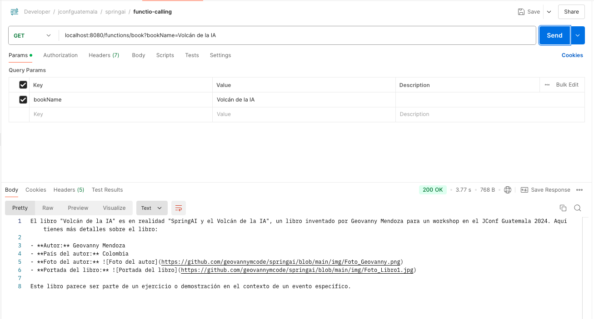
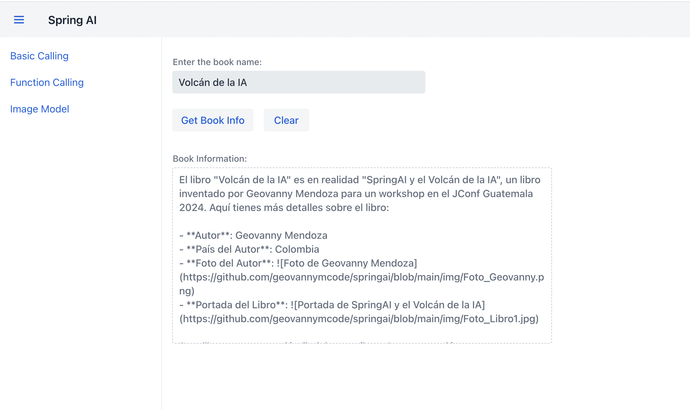

# **Funcion Calling**

## **Descripción**

La **Function Calling** en OpenAI y Spring AI permite que el modelo de IA no solo genere respuestas en texto, sino que también invoque funciones específicas del backend para obtener información precisa y estructurada. Esto transforma el modelo de IA en un intermediario inteligente que puede interactuar con bases de datos o servicios externos y devolver resultados específicos según la solicitud del usuario.

A diferencia del modelo de chat básico, donde las respuestas son generadas únicamente por el modelo de IA basado en el contexto de la conversación, **Function Calling** permite conectar el modelo con funcionalidades específicas (como buscar información de un libro en una base de datos). Esto ofrece resultados más precisos y controlados, garantizando que las respuestas sean coherentes y actualizadas, y ampliando las capacidades de la IA para integrarse con aplicaciones empresariales.

### **Paso 1: Controlador FunctionCallingController**

El controlador `FunctionCallingController` define el endpoint para obtener la información de un libro utilizando el modelo de chat de OpenAI.

```java title="FunctionCallingController.java" linenums="1"
@RestController
@RequestMapping("/functions")
@RequiredArgsConstructor
public class FunctionCallingController {
    private final OpenAiChatModel openAiChatModel;

    @GetMapping("/book")
    public ResponseEntity<String> getBookInfo(@RequestParam("bookName") String bookName) {
        UserMessage userMessage = new UserMessage("¿Cual es la información de este libro " + bookName + "?");

        ChatResponse response = openAiChatModel.call(new Prompt(List.of(userMessage),
                OpenAiChatOptions.builder().withFunction("BookInfo").build()
        ));

        String result = response.getResult().getOutput().getContent();

        return ResponseEntity.ok(result);
    }
}
```

- **Línea 1** `@GetMapping("/book")`: Define el endpoint `/functions/book` que recibe el nombre de un libro como parámetro de consulta (`bookName`).
- **Línea 1** `UserMessage`: Crea un mensaje de usuario preguntando sobre la información del libro especificado.
- **Línea 1** `OpenAiChatOptions`: Usa la opción `withFunction("BookInfo")` para indicar que queremos que el modelo llame a la función `BookInfo` para obtener los datos del libro.
- **Línea 1** `response.getResult().getOutput().getContent()`: Extrae la respuesta generada por la IA y la devuelve al cliente.

### **Paso 2: Configuración de Funciones (`FunctionConfig`)**

La clase `FunctionConfig` configura las funciones disponibles en el modelo de IA. Define las funciones `weatherFunctionInfo` y `bookInfoFunction`.

```java title="FunctionConfig.java" linenums="1"
@Configuration
public class FunctionConfig {

    @Bean
    public FunctionCallback weatherFunctionInfo() {
        return FunctionCallbackWrapper.builder(new MockWeatherService())
                .withName("weatherFunction")
                .withDescription("Get the weather in location")
                .withResponseConverter(response -> "" + response.temp() + response.unit())
                .build();
    }

    @Bean
    public FunctionCallback bookInfoFunction(IBookRepo repo) {
        return FunctionCallbackWrapper.builder(new BookFunctionServiceImpl(repo))
                .withName("BookInfo")
                .withDescription("Get book info from book name")
                .withResponseConverter(response -> "" + response.books())
                .build();
    }
}
```

- **Línea 1** `weatherFunctionInfo`: Configura una función ficticia para obtener información del clima. (En este ejemplo no la usaremos en el formulario).
- **Línea 1** `bookInfoFunction`:
    - `FunctionCallbackWrapper.builder(new BookFunctionServiceImpl(repo))`: Crea una función que obtiene información de un libro desde el repositorio de libros.
    - `withName("BookInfo")`: Define el nombre de la función como BookInfo, que se utiliza en el controlador para obtener detalles del libro.
    - `withResponseConverter(...)`: Configura un convertidor de respuesta para mostrar los detalles del libro de una manera específica.
 
### **Paso 3: Prueba en Postman**

Para verificar que el endpoint funcione correctamente, realizamos una prueba en Postman, como se puede observar en la **figura #3**:



**Figura #3: Prueba del Endpoint** `/functions/book` **con Postman**

- **Endpoint**: `GET http://localhost:8080/functions/book?bookName=Volcán de la IA`
- **Respuesta**: El servidor responde con información detallada del libro en formato de texto (como se muestra en la captura de pantalla). Incluye detalles como el nombre del autor, país, foto del autor, y portada del libro.

### **Paso 4: Integración en Vaadin (FunctionCallingView)**

Ahora integramos la funcionalidad en Vaadin para que los usuarios puedan consultar la información del libro desde la interfaz web.

```java title="FunctionConfig.java" linenums="1"
@Route("book-info")
@Menu(title = "FunctionCallingView", order = 2)
public class FunctionCallingView extends VerticalLayout {
    private final RestTemplate restTemplate = new RestTemplate();
    private final String backendUrl = "http://localhost:8080/functions/book";

    public FunctionCallingView() {
        setSizeFull();

        // Campo de texto para ingresar el nombre del libro
        TextField bookNameInput = new TextField("Enter the book name:");
        bookNameInput.setWidth("400px");

        // Botón de envío
        Button sendButton = new Button("Get Book Info");
        Button clearButton = new Button("Clear");

        // Área de texto para mostrar la respuesta
        TextArea resultArea = new TextArea("Book Information:");
        resultArea.setWidth("600px");
        resultArea.setHeight("300px");
        resultArea.setReadOnly(true); // Solo lectura para mostrar la respuesta

        HorizontalLayout buttonLayout = new HorizontalLayout(sendButton, clearButton);

        sendButton.addClickListener(click -> {
            String bookName = bookNameInput.getValue();

            // Construye la URL con el parámetro del libro
            String url = backendUrl + "?bookName=" + bookName;

            // Llama al backend para obtener la información del libro
            ResponseEntity<String> responseEntity = restTemplate.getForEntity(url, String.class);

            if (responseEntity.getStatusCode().is2xxSuccessful() && responseEntity.getBody() != null) {
                resultArea.setValue(responseEntity.getBody());  // Muestra la respuesta en el área de texto
            } else {
                resultArea.setValue("Error: Failed to get book information.");
            }
        });

        // Botón para limpiar el área de respuesta
        clearButton.addClickListener(click -> {
            resultArea.clear();
            bookNameInput.clear();
        });

        add(bookNameInput, buttonLayout, resultArea);
    }
}
```

- **Línea 1** `@Route("book-info")`: Define la ruta de esta vista como /book-info.
- **Línea 11** `TextField bookNameInput`: Campo de texto donde el usuario ingresa el nombre del libro que desea consultar.
- **Línea 15** `Button sendButton`: Botón para enviar la solicitud al backend.
- **Línea 16** `Button clearButton`: Botón para limpiar la entrada y el área de resultados.
- **Línea 19** `TextArea resultArea`: Área de texto en solo lectura para mostrar la información del libro.
- **Lógica del Botón `sendButton`**:
    - Construye la URL de la solicitud con el nombre del libro como parámetro (`bookName`).
    - Llama al backend utilizando `restTemplate` y muestra la respuesta en `resultArea`.
    - Si la solicitud falla, muestra un mensaje de error.
- **Lógica del Botón `clearButton`**: Limpia el campo de entrada y el área de resultados, permitiendo una nueva consulta.

### **Visualización del Formulario**

Como se muestrar en la **Figura #4**, asi luce la interfaz de `FunctionCallingView` en Vaadin:


**Figura #4: Formulario Function Calling**

- **Campo de Texto**: El usuario ingresa el nombre del libro ("Volcán de la IA").
- **Botón "Get Book Info"**: Envía la solicitud al backend para obtener la información del libro.
- **Área de Resultados**: Muestra la información del libro en un cuadro de texto. En el ejemplo, se detalla que el libro "Volcán de la IA" es una obra ficticia creada para un workshop, junto con el autor y enlaces a imágenes.