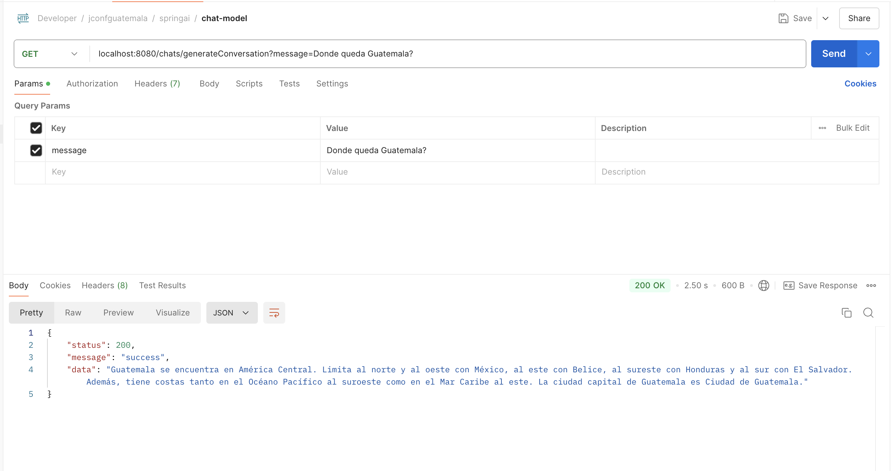
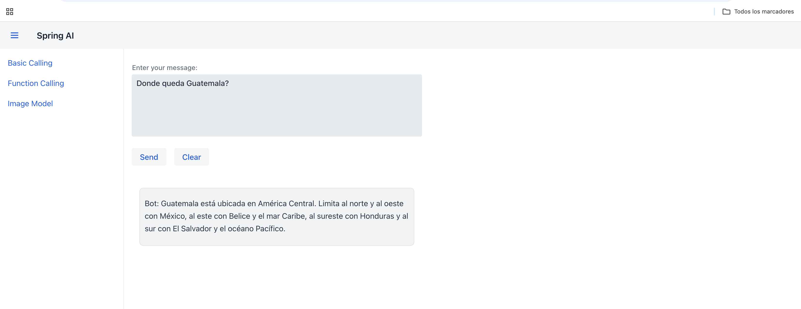

# **Chat Model**

## **Paso 1: Configuración de la Clave API de OpenAI**

Para que nuestra aplicación pueda acceder a los modelos de OpenAI, necesitamos una clave API válida de OpenAI. Esta clave permite autenticar las solicitudes y garantiza que la aplicación tenga permiso para utilizar los modelos de lenguaje. Asegúrate de tener una cuenta en OpenAI y de obtener una clave API desde su sitio web.

Una vez tengas la clave, debes configurarla en el archivo `application.yml` para que esté disponible en el proyecto. La configuración debería verse así:

```yaml title="Application.yml" linenums="1"
spring:
  ai:
    openai:
      api-key: `SPRING_AI_OPENAI_API_KEY`
```

- **Nota**: Reemplaza `SPRING_AI_OPENAI_API_KEY` con tu clave API real de OpenAI.

Esta configuración permitirá que nuestra aplicación Spring Boot acceda a la clave a través de la anotación `@Value` en la clase de configuración `OpenAIConfig`.

## **Paso 2: Clase de Configuración `OpenAIConfig`**

Para crear una instancia de **OpenAiChatModel** (la clase que interactúa con los modelos de OpenAI), necesitamos una clase de configuración que inyecte la clave API y configure los parámetros básicos para las solicitudes de generación de texto. Esta clase es `OpenAIConfig`.

```java title="OpenAIConfig.java" linenums="1"
@Configuration
public class OpenAIConfig {

    @Value("${spring.ai.openai.api-key}")
    private String API_KEY;

    @Bean
    public OpenAiChatModel openAiChatModel() {
        final OpenAiApi openAiApi = new OpenAiApi(API_KEY);

        return new OpenAiChatModel(openAiApi, OpenAiChatOptions.builder()
                .withModel("gpt-3.5-turbo")
                .withTemperature(0.8)
                .withMaxTokens(200)
                .build()
        );
    }
}
```

- **Línea 1**: `@Configuration` Anota la clase para que Spring la reconozca como una clase de configuración. Esto significa que Spring gestionará los beans definidos dentro de esta clase.

- **Línea 4**: `@Value("${spring.ai.openai.api-key}")` Inyecta el valor de la clave API de OpenAI desde el archivo application.yml. Esta clave es necesaria para autenticar las solicitudes al servicio de OpenAI.

- **Línea 8**: `Método openAiChatModel()` Este método define un bean de tipo `OpenAiChatModel`, que es el cliente que utilizaremos para enviar solicitudes a OpenAI.

- **Línea 9**: `OpenAiApi` Se inicializa con la clave API, permitiendo la comunicación segura con OpenAI.
- **Línea 11**: `OpenAiChatModel` Esta instancia se configura con `OpenAiChatOptions` para definir parámetros específicos como:
- **Línea 12**: `withModel("gpt-3.5-turbo")` Especifica el modelo que utilizaremos, en este caso, gpt-3.5-turbo.
- **Línea 13**: `withTemperature(0.8)` Controla la creatividad de las respuestas generadas. Valores más bajos hacen las respuestas más conservadoras, mientras que valores más altos (hasta 1) hacen las respuestas más creativas.
- **Línea 14**: `withMaxTokens(200)` Define el límite de tokens (unidades de texto) en la respuesta. Esto evita que las respuestas sean demasiado largas y controla el costo de las solicitudes.
- **Línea 15**: `build()`: Este método se utiliza para finalizar la construcción de OpenAiChatOptions y devuelve una instancia configurada de estas opciones. Sin build(), la configuración del cliente quedaría incompleta y lanzaría un error.

Este bean estará disponible para ser inyectado en otras clases, como el controlador `ChatController`, permitiéndonos realizar llamadas a la API de OpenAI.

## **Paso 3: Clase `ResponseDTO`**

La clase `ResponseDTO` es un **Data Transfer Object (DTO)** que permite estructurar las respuestas enviadas desde los endpoints en el controlador. Este patrón es útil para mantener consistencia en las respuestas, asegurando que cada respuesta contenga un estado, un mensaje y los datos específicos.

```java title="ChatController.java" linenums="1"
@AllArgsConstructor
@NoArgsConstructor
@Getter
@Setter
public class ResponseDTO<T> {
    private int status;
    private String message;
    private T data;
}
```

### **Anotaciones y Propiedades**

- `@AllArgsConstructor`: Genera un constructor que acepta valores para todos los atributos (`status`, `message`, y `data`), lo cual facilita la creación de instancias con todos los campos inicializados.

- `@NoArgsConstructor`: Genera un constructor sin argumentos, permitiendo la creación de instancias vacías de `ResponseDTO`.

- `@Getter` y `@Setter`: Estas anotaciones de Lombok generan automáticamente los métodos `get` y `set` para cada propiedad, simplificando el acceso y modificación de los atributos sin necesidad de escribirlos manualmente.

### **Propiedades**

- `status` (`int`): Representa el código de estado de la respuesta (por ejemplo, `200` para éxito, `400` para errores de cliente, etc.). Esto facilita la interpretación del estado de la solicitud en el cliente.

- `message` (`String`): Proporciona un mensaje descriptivo sobre el resultado de la solicitud. Este mensaje puede ser "success", "error", u otra descripción, y ayuda al cliente a entender mejor el contexto de la respuesta.

- `data` (`T`): Representa los datos específicos devueltos por el endpoint. Esta es una propiedad genérica (`<T>`), lo que significa que puede contener cualquier tipo de objeto. Esto permite que `ResponseDTO` sea reutilizable en distintos endpoints, adaptándose a las necesidades de cada uno.

## **Paso 4:Controlador `ChatController`**

El controlador `ChatController` expone dos endpoints para interactuar con la IA de OpenAI. A través de estos endpoints, los usuarios pueden enviar mensajes y obtener respuestas generadas por el modelo de IA. Este controlador permite:

- Generación de texto simple en base a un mensaje.
- Generación de conversaciones manteniendo un historial de mensajes, para que el modelo pueda tener contexto en las respuestas.

```java title="ChatController.java" linenums="1"
@RestController
@RequestMapping("/chats")
@CrossOrigin(origins = "*")
@RequiredArgsConstructor
public class ChatController {

    private final OpenAiChatModel openAiChatModel;
    private final ChatHistory chatHistory;

    @GetMapping("/generate")
    public ResponseEntity<ResponseDTO<String>> generateText(@RequestParam String message) {
        ChatResponse chatResponse = openAiChatModel.call(new Prompt(message));
        String result = chatResponse.getResult().getOutput().getContent();

        return ResponseEntity.ok(new ResponseDTO<>(200, "success", result));
    }

    @GetMapping("/generateConversation")
    public ResponseEntity<ResponseDTO<String>> generateConversation(@RequestParam String message){
        chatHistory.addMessage("1", new UserMessage(message));

        ChatResponse chatResponse = openAiChatModel.call(new Prompt(chatHistory.getAll("1")));
        String result = chatResponse.getResult().getOutput().getContent();

        return ResponseEntity.ok(new ResponseDTO<>(200, "success", result));
    }
}
```

- **Línea 1**: `@RestController` Indica que esta clase es un controlador REST. Spring gestionará automáticamente las solicitudes HTTP y las respuestas en formato JSON.

- **Línea 2**: `@RequestMapping("/chats")` Define el prefijo de la URL para todos los endpoints de este controlador (`/chats`).

- **Línea 3**: `@CrossOrigin(origins = "*")` Permite solicitudes CORS desde cualquier origen, lo cual es útil para desarrollo. En producción, puedes restringirlo a un dominio específico.

- **Línea 4**: `@RequiredArgsConstructor` Genera un constructor para inyectar los componentes `openAiChatModel` y `chatHistory` (gestión del historial de la conversación), facilitando la inyección de dependencias.

### **Métodos en el `ChatController`**

1. **Línea 10**: `generateText (@GetMapping("/generate"))`
       - **Objetivo**: Generar una respuesta de texto simple en base a un mensaje proporcionado por el usuario.
       - **Parámetro**: `message`, que contiene el texto enviado por el usuario.
       - **Lógica**:
          - Crea una instancia de `Prompt` con el mensaje del usuario.
          - Llama al método `call` de `openAiChatModel`, que envía el `Prompt` a OpenAI.
          - Obtiene la respuesta generada por el modelo (`chatResponse`) y extrae el contenido de texto (`result`).
       - **Respuesta**: Devuelve un `ResponseDTO` con el estado y el texto generado.

2. **Línea 18**: `generateConversation (@GetMapping("/generateConversation"))`
       - **Objetivo**: Generar una respuesta basada en una conversación con contexto.
       - **Parámetro**: message, que representa el mensaje actual del usuario.
       - **Lógica**:
          - Agrega el mensaje al historial de conversación (chatHistory) usando un identificador de conversación (`"1"`).
          - Envía todo el historial de mensajes al modelo, en lugar de solo el mensaje actual. Esto permite que el modelo de IA genere respuestas considerando el contexto.
          - Obtiene y devuelve la respuesta generada, al igual que en el método generateText.
       - **Respuesta**: Devuelve un `ResponseDTO` con el estado y la respuesta generada por el modelo de IA.

## **Paso 5:Clase `ChatHistory`**

La clase `ChatHistory` es un componente de Spring (`@Component`) que almacena el historial de mensajes para cada conversación y permite realizar un seguimiento de los mensajes agregados. Esto permite que el modelo de IA tenga contexto en las respuestas, lo cual es útil para conversaciones continuas en las que cada mensaje depende de los anteriores.

```java title="ChatController.java" linenums="1"
@Component
public class ChatHistory {

    private static final Logger logger = LoggerFactory.getLogger(ChatHistory.class);

    private final Map<String, List<Message>> chatHistoryLog;
    private final Map<String, List<Message>> messageAggregations;

    public ChatHistory() {
        this.chatHistoryLog = new ConcurrentHashMap<>();
        this.messageAggregations = new ConcurrentHashMap<>();
    }

    public void addMessage(String chatId, Message message) {
        String groupId = toGroupId(chatId, message);

        this.messageAggregations.computeIfAbsent(groupId, key -> new ArrayList<>()).add(message);

        if (this.messageAggregations.size() > 1) {
            logger.warn("Multiple active sessions: {}", this.messageAggregations.keySet());
        }

        String finishReason = getProperty(message, "finishReason");
        if ("STOP".equalsIgnoreCase(finishReason) || message.getMessageType() == MessageType.USER) {
            this.finalizeMessageGroup(chatId, groupId);
        }
    }

    private String toGroupId(String chatId, Message message) {
        String messageId = getProperty(message, "id");
        return chatId + ":" + messageId;
    }

    private String getProperty(Message message, String key) {
        return message.getMetadata().getOrDefault(key, "").toString();
    }

    private void finalizeMessageGroup(String chatId, String groupId) {
        List<Message> sessionMessages = this.messageAggregations.remove(groupId);

        if (sessionMessages != null) {
            if (sessionMessages.size() == 1) {
                this.commitToHistoryLog(chatId, sessionMessages.get(0));
            } else {
                String aggregatedContent = sessionMessages.stream()
                        .map(Message::getContent)
                        .filter(Objects::nonNull)
                        .collect(Collectors.joining());
                this.commitToHistoryLog(chatId, new AssistantMessage(aggregatedContent));
            }
        } else {
            logger.warn("No active session for groupId: {}", groupId);
        }
    }

    private void commitToHistoryLog(String chatId, Message message) {
        this.chatHistoryLog.computeIfAbsent(chatId, key -> new ArrayList<>()).add(message);
    }

    public List<Message> getAll(String chatId) {
        return this.chatHistoryLog.getOrDefault(chatId, List.of());
    }
}
```

### **Componentes de `ChatHistory`**

- **Línea 1**: `@Component` Indica que esta clase es un componente de Spring, lo que permite que Spring la gestione como un bean y la inyecte en otras clases.

- **Línea 4**: Logger: Se utiliza Logger para registrar advertencias, especialmente si se detectan múltiples sesiones activas o si no hay una sesión activa para un grupo de mensajes específico.

- **Estructuras de Datos**:
      - **Línea 6**: `chatHistoryLog (Map<String, List<Message>>)` Este mapa almacena el historial completo de cada conversación, agrupado por chatId. Cada chatId tiene una lista de mensajes que representa toda la conversación.
      - **Línea 7**: `messageAggregations (Map<String, List<Message>>)` Almacena mensajes agrupados temporalmente por sesión antes de que se finalicen y se registren en chatHistoryLog. Esta estructura permite manejar múltiples mensajes en una sesión, útil para conversaciones donde la IA responde en varias partes.

### **Métodos en ChatHistory**

- **Línea 14** addMessage(String chatId, Message message)
      - **Propósito**: Agrega un mensaje a la sesión actual o crea una nueva si es necesario.
      - **Parámetros**:
          - **chatId**: Identificador de la conversación.
          - **message**: El mensaje que se quiere agregar.
      - **Lógica**:
          - Genera un `groupId` único para la sesión actual usando `chatId` y `message`.
          - Agrega el mensaje a messageAggregations, y si hay varias sesiones activas, registra una advertencia.
          - Verifica si el mensaje indica el fin de una conversación (finishReason == "STOP") o si es un mensaje de usuario. Si es así, llama a finalizeMessageGroup para guardar el mensaje en el historial permanente (chatHistoryLog).

- **Línea 29** toGroupId(String chatId, Message message):
      - **Propósito**:Crea un identificador único (groupId) para la sesión, combinando chatId y messageId.
      - **Uso**: Asegura que cada sesión tenga un identificador único basado en la conversación y el mensaje.

- **Línea 34** getProperty(Message message, String key):
      - **Propósito**: Recupera el valor de una propiedad específica de message, como finishReason o id.
      - **Uso**: Facilita el acceso a propiedades en el metadata del mensaje.

- **Línea 38** finalizeMessageGroup(String chatId, String groupId):
      - **Propósito**: Mueve los mensajes agrupados temporalmente desde messageAggregations al historial permanente en chatHistoryLog.
      - **Lógica**:
            - Elimina el grupo de mensajes de messageAggregations.
            - Si solo hay un mensaje en el grupo, lo guarda directamente en el historial. Si hay varios, combina sus contenidos y luego lo guarda.
            - Si no hay mensajes en el grupo, registra una advertencia de sesión inactiva.

- **Línea 56** commitToHistoryLog(String chatId, Message message):
      - **Propósito**: Agrega un mensaje al historial permanente chatHistoryLog.
      - **Uso**: Llama a este método cuando una sesión se ha finalizado, para registrar el contenido en el historial de conversación.

- **Línea 60** getAll(String chatId):
      - **Propósito**: Devuelve el historial completo de mensajes para un chatId específico.
      - **Uso**: Se utiliza en el controlador para recuperar el historial de una conversación completa y enviarlo al modelo de IA para proporcionar contexto en las respuestas.

### **Ejemplo de Uso en el Segundo Endpoint**

En el endpoint `generateConversation` del `ChatController`, `ChatHistory` permite mantener un contexto de conversación. Cada mensaje del usuario se agrega a `ChatHistory`, y luego se obtiene el historial completo de la conversación antes de enviarlo al modelo de IA. Esto permite que la IA genere una respuesta considerando toda la conversación hasta el momento.

## **Paso 6: Prueba del Endpoint con Postman**

Para asegurarnos de que el endpoint de conversación funcione correctamente, utilizamos Postman para realizar una prueba. La **Figura #1** muestra cómo se realizó la prueba para el endpoint `/chats/generateConversation`.



**Figura #1: Prueba del Endpoint** `/chats/generateConversation` **con Postman**

**Descripción**: En la Figura #1, se observa cómo se configuró y envió la solicitud en Postman:

1. **Método y URL**:
    - Se seleccionó el método **GET** y se ingresó la URL:

        ```bash
        http://localhost:8080/chats/generateConversation?message=Donde queda Guatemala?
        ```

    - Aquí, el parámetro de consulta message se establece con el valor "Donde queda Guatemala?".

2. **Parámetro de Consulta**:
    - En la sección **Params** de Postman, se agregó el parámetro de consulta `message` con el valor deseado, lo cual será procesado por el modelo de IA para generar una respuesta contextualizada.

3. **Respuesta del Servidor**:
    - En la parte inferior de la imagen, se muestra la respuesta recibida:

        ```json
        {
            "status": 200,
            "message": "success",
            "data": "Guatemala se encuentra en América Central. 
            Limita al norte y al oeste con México, al este con Belice, 
            al sureste con Honduras y al sur con El Salvador. 
            Además, tiene costas tanto en el Océano Pacífico al suroeste 
            como en el Mar Caribe al este. 
            La ciudad capital de Guatemala es Ciudad de Guatemala."
        }
        ```

4. **Esta respuesta incluye**:
      - `status`: Indica el estado de la solicitud, con `200` para confirmar que fue exitosa.
      - `message`: Un mensaje de éxito (`"success"`).
      - `data`: Contiene la respuesta generada por la IA, con información sobre Guatemala.

## **¿Por Qué Usamos Vaadin en el Proyecto?**

**Vaadin** es un framework de Java que permite construir interfaces de usuario en el frontend directamente en Java, sin necesidad de escribir código en HTML, CSS o JavaScript. Es especialmente útil para aplicaciones empresariales porque:

1. **Facilidad de Desarrollo**: Vaadin permite a los desarrolladores trabajar en el frontend y el backend en Java, simplificando la integración entre ambos.
2. **Componentes UI Listos para Usar**: Ofrece una amplia gama de componentes de interfaz de usuario que pueden ser personalizados, lo que facilita la creación de una UI rica y responsiva.
3. **Sin Necesidad de JavaScript**: Permite crear aplicaciones web modernas sin tener que escribir JavaScript, ya que todo se maneja desde el backend en Java.
4. **Integración Directa con Spring Boot**: Vaadin se integra de manera fluida con Spring Boot, lo que hace que la construcción de aplicaciones Java completas sea más eficiente y menos compleja.

En nuestro caso, Vaadin nos permite crear una interfaz interactiva para enviar mensajes al modelo de IA y mostrar respuestas, sin necesidad de manejar un frontend independiente.

## **Paso 7: Clase `MainLayout`**

La clase `MainLayout` extiende `AppLayout`, una clase base en Vaadin que proporciona la estructura para layouts de aplicaciones con una barra de navegación superior y un menú lateral. Este layout permite que todas las vistas de nuestra aplicación compartan la misma estructura.

```java title="MainLayout.java" linenums="1"
@Layout
public class MainLayout extends AppLayout {

    public MainLayout() {
        var head = new HorizontalLayout();
        head.setDefaultVerticalComponentAlignment(FlexComponent.Alignment.CENTER);
        head.add(new DrawerToggle());
        head.add(new H2("Spring AI"){{addClassNames(LumoUtility.FontSize.LARGE);}});

        addToNavbar(head);

        var sideBar = new VerticalLayout();

        MenuConfiguration.getMenuEntries().forEach(menuEntry -> {
            sideBar.add(new RouterLink(menuEntry.title(), menuEntry.menuClass()));
        });

        addToDrawer(sideBar);
    }
}
```

- **Línea 1** `@Layout`: Aunque no es una anotación estándar en Java, en este contexto parece una convención o anotación personalizada (probablemente configurada en el proyecto) que designa esta clase como el layout principal para otras vistas en Vaadin.

- **Línea 1** **Extiende** `AppLayout`: `AppLayout` es la clase base de Vaadin para layouts de aplicaciones con un menú lateral y una barra de navegación superior. Al extender `AppLayout`, `MainLayout` se convierte en el layout principal de la aplicación, proporcionando un diseño común para todas las vistas.

- **Línea 4** - **Constructor** `MainLayout()`:
    - **Barra de Navegación Superior (Navbar)**:
        - Se crea un `HorizontalLayout` llamado `head`que contiene los elementos de la barra de navegación superior.
        - `DrawerToggle`: Este componente agrega un icono de "menú hamburguesa" (tres líneas horizontales) en la barra de navegación superior. Al hacer clic en este icono, el menú lateral se abre o se cierra. Esto es especialmente útil en dispositivos móviles o pantallas pequeñas, ya que permite al usuario ocultar o mostrar el menú lateral para aprovechar mejor el espacio en pantalla.
        - `Título`: Añadimos un título con el texto "Spring AI" usando un componente `H2`. Aplicamos estilos para que el tamaño de la fuente sea grande (`LumoUtility.FontSize.LARGE`).
        - `addToNavbar(head)`: Este método añade el `head` a la barra de navegación superior.
    - **Menú Lateral (Sidebar)**:
        - Se crea un `VerticalLayout` llamado `sideBar`para el menú lateral.
        - `Menú Dinámico`: Utilizamos `MenuConfiguration.getMenuEntries()` para obtener las entradas de menú configuradas en el proyecto. Para cada entrada, se crea un enlace de navegación (`RouterLink`) que redirige a la clase correspondiente.
        - `addToDrawer(sideBar)`: Este método añade el `sideBar` al drawer o menú lateral.
    - **Propósito del** `MainLayout`:
        - **El MainLayout tiene dos objetivos principales**:
            - `Uniformidad`: Al utilizar un layout común para todas las vistas, la aplicación mantiene un diseño consistente en cada sección. Esto asegura que el usuario tenga una experiencia visual uniforme, independientemente de la vista que esté utilizando, lo cual mejora la experiencia y facilita la navegación.
            - `Modularidad`: Separar el layout principal del contenido específico de cada vista permite agregar, modificar o eliminar vistas sin afectar la estructura general de la interfaz. Esto significa que podemos cambiar el contenido de las vistas individuales sin necesidad de ajustar el diseño principal.

Ahora vamos a agregar la clase `HomeView`, que servirá como la vista principal de la aplicación. Esta vista se mostrará en la ruta raíz (`/`) de la aplicación y utilizará `MainLayout` como layout base.

```java title="HomeView.java" linenums="1"
@Route(value = "", layout = MainLayout.class)  // Ruta principal
public class HomeView extends VerticalLayout {
    public HomeView() {
        add(new H1("Welcome to Enterprise AI Jug Guatemala 2024"));
    }
}
```

- **Línea 1** - `@Route`:
    - `value = "":` Define la ruta de esta vista como la raíz de la aplicación (`/`). Esto significa que cuando los usuarios accedan a `http://localhost:8080`, se les mostrará esta vista.
    - `layout = MainLayout.class`: Especifica que `HomeView` usará `MainLayout` como su layout base. Esto asegura que la vista de inicio tenga la misma estructura de navegación y diseño que el resto de las vistas de la aplicación.

- **Línea 1** - `VerticalLayout`:
    - `HomeView` extiende `VerticalLayout`, que es un layout vertical en Vaadin. Esto organiza los componentes que contiene de manera vertical.
    - Al extender `VerticalLayout`, `HomeView` puede añadir componentes uno debajo del otro, aprovechando la alineación vertical.

- **Líneas 3-4: Constructor de `HomeView`**:
    - `add(new H1("Welcome to Enterprise AI Jug Guatemala 2024"))`: Añade un título principal (`H1`) con el mensaje "Welcome to Enterprise AI Jug Guatemala 2024". Este mensaje se mostrará en la pantalla principal de la aplicación y sirve como bienvenida para los usuarios.

`HomeView` actúa como la página de bienvenida de la aplicación. Al utilizar `MainLayout`, garantiza que la estructura de la barra de navegación superior y el menú lateral estén presentes, proporcionando una experiencia de usuario consistente desde el primer acceso. Esta vista es perfecta para dar una introducción o mensaje de bienvenida a los usuarios.

## **Paso 8: Adicionar el Formulario `BasicCallView`**

El formulario en BasicCallView como se muestra en la **figura #2** permite al usuario enviar mensajes al backend y recibir respuestas generadas por un modelo de IA. La interfaz está diseñada para simular un chat básico donde el usuario puede ingresar una pregunta o mensaje, enviarlo, y ver la respuesta del "bot" en tiempo real.


**Figura #2: interfaz en acción**

### **Componentes del Formulario**

1. **Campo de Entrada de Mensaje (TextArea)**: El usuario ingresa el mensaje en el área de texto etiquetada como "Enter your message:". Esta área de texto es amplia y está diseñada para mensajes largos.

2. **Botones de Acción**:
    - **Send**: Envía el mensaje al backend cuando se hace clic. La respuesta generada por la IA se muestra en el área de mensajes justo debajo.
    - **Clear**: Limpia tanto el área de entrada de texto como el historial de mensajes.

3. **Área de Mensajes**: Las respuestas generadas por el modelo de IA se presentan en esta sección. Cada respuesta aparece en un contenedor separado, con estilo, para diferenciarlo del área de entrada.
```java title="BasicCallView.java" linenums="1"
@Route("chat")
@Menu(title = "Basic Calling", order = 1)
public class BasicCallView extends VerticalLayout {

    private final RestTemplate restTemplate = new RestTemplate();  // Cliente para hacer solicitudes HTTP
    private final String backendUrl = "http://localhost:8080/chats/generateConversation";  // URL de tu controlador

    public BasicCallView() {
        setSizeFull();

        TextArea messageInput = new TextArea("Enter your message:");
        messageInput.setWidth("600px"); // Ajusta el ancho del área de texto
        messageInput.setHeight("150px"); // Ajusta la altura del área de texto

        Button sendButton = new Button("Send");
        Button clearButton = new Button("Clear");

        // Area para mostrar la respuesta
        VerticalLayout messages = new VerticalLayout();
        messages.setWidth("600px");

        // Layout horizontal para los botones
        HorizontalLayout buttonLayout = new HorizontalLayout(sendButton, clearButton);

        sendButton.addClickListener(click -> {
            String message = messageInput.getValue();
            // Usando ParameterizedTypeReference para manejar el tipo de datos genérico
            ResponseEntity<ResponseDTO<String>> responseEntity = restTemplate.exchange(
                    backendUrl + "?message=" + message,
                    HttpMethod.GET,
                    null,
                    new ParameterizedTypeReference<ResponseDTO<String>>() {}
            );


            if (responseEntity.getStatusCode().is2xxSuccessful() && responseEntity.getBody() != null) {
                String response = responseEntity.getBody().getData();  // Extraer el mensaje de respuesta
               // messages.add(new Paragraph("Bot: " + response));
                Div responseContainer = new Div();
                responseContainer.getStyle()
                        .set("padding", "10px")
                        .set("margin-top", "10px")
                        .set("background-color", "#f1f3f4")
                        .set("border-radius", "8px")
                        .set("border", "1px solid #e0e0e0");
                responseContainer.add(new Paragraph("Bot: " + response));
                messages.add(responseContainer);
            } else {
                messages.add(new Paragraph("Error: Failed to get response from backend"));
            }
        });

        // Botón para limpiar el área de mensajes
        clearButton.addClickListener(click -> {
            messages.removeAll();
            messageInput.clear();
        });

        add(messageInput, buttonLayout, messages);
    }
}
```

- **Línea 1** `@Route("chat")`: Define la ruta de esta vista como `/chat`. Esto significa que cuando accedemos a `http://localhost:8080/chat`, se mostrará esta vista.

- **Línea 2** `@Menu(title = "Basic Calling", order = 1)`: Anotación personalizada (probablemente configurada en el proyecto) para definir el título y el orden del elemento en el menú de navegación. El título es "Basic Calling" y la posición en el menú es la primera (`order = 1`).

- **Línea 3** `public class BasicCallView extends VerticalLayout`: Define la clase `BasicCallView` que extiende `VerticalLayout`. Esto significa que los componentes añadidos se organizarán verticalmente.

- **Línea 5** `String backendUrl = "http://localhost:8080/chats/generateConversation";`: Define la URL del endpoint del backend al que se enviarán las solicitudes para obtener respuestas de la IA.

- **Línea 6** `setSizeFull();`: Configura el tamaño de BasicCallView para que ocupe todo el espacio disponible en la pantalla.

- **Línea 9** `RestTemplate restTemplate = new RestTemplate();`: Crea una instancia de RestTemplate, un cliente HTTP de Spring para realizar solicitudes HTTP al backend.

### **Configuración de los Componentes de la Interfaz**

- **Línea 11** `TextArea messageInput = new TextArea("Enter your message:");`: Crea un área de texto (`TextArea`) para que el usuario ingrese su mensaje. El texto "Enter your message:" se muestra como etiqueta.

- **Línea 12** `messageInput.setWidth("600px");`: Define el ancho del área de texto como `600px`.

- **Línea 13** `messageInput.setHeight("150px");`: Define la altura del área de texto como `150px`.

- **Línea 15** `Button sendButton = new Button("Send");`: Crea un botón llamado "Send" para enviar el mensaje al backend.

- **Línea 16** `Button clearButton = new Button("Clear");`: Crea un botón llamado "Clear" para limpiar el área de mensajes y el campo de entrada.

### **Configuración del Área de Mensajes**

- **Línea 19** `VerticalLayout messages = new VerticalLayout();`: Crea un `VerticalLayout` para organizar las respuestas generadas por la IA de manera vertical, una debajo de la otra.

- **Línea 20** `messages.setWidth("600px");`: Define el ancho del área de mensajes como `600px`, igual que el área de entrada de texto, para mantener consistencia en el diseño.

### **Configuración del Layout de los Botones**

- **Línea 23** `HorizontalLayout buttonLayout = new HorizontalLayout(sendButton, clearButton);`: Crea un HorizontalLayout que contiene los botones sendButton y clearButton, organizándolos horizontalmente en la interfaz.

### **Botón "Send"**

- **Línea 25** `sendButton.addClickListener(click -> { ... })`: Añade un listener al botón "Send" para definir lo que ocurre al hacer clic. Aquí se maneja el evento de enviar el mensaje al backend.

- **Línea 26** `String message = messageInput.getValue();`: Obtiene el valor ingresado por el usuario en el messageInput y lo guarda en la variable message.

- **Líneas 28-33** `ResponseEntity<ResponseDTO<String>> responseEntity = restTemplate.exchange(...)`: Realiza una solicitud HTTP GET al backend.
    - `backendUrl + "?message=" + message`: Construye la URL con el mensaje como parámetro de consulta.
    - `HttpMethod.GET`: Define el método de la solicitud como GET.
    - `null`: No se pasan encabezados o cuerpo en la solicitud.
    - `new ParameterizedTypeReference<ResponseDTO<String>>() {}`: Define el tipo de respuesta esperada como `ResponseDTO<String>`, permitiendo a `RestTemplate` manejar respuestas genéricas.

- **Línea 36** `if (responseEntity.getStatusCode().is2xxSuccessful() && responseEntity.getBody() != null)`: Verifica si la solicitud fue exitosa (código 2xx) y si el cuerpo de la respuesta no es nulo.
- **Línea 37** `String response = responseEntity.getBody().getData();`: Obtiene el campo `data` de la respuesta, que contiene el mensaje generado por la IA.
- **Línea 39** `Div responseContainer = new Div();`: Crea un contenedor (`Div`) para mostrar el mensaje de respuesta de la IA.
- **Líneas 40-45** `responseContainer.getStyle().set(...)`: Aplica estilos CSS para mejorar la apariencia del contenedor:
    - `padding`: Espacio interno de `10px`.
    - `margin-top`: Espacio superior de `10px` entre mensajes.
    - `background-color`: Fondo gris claro.
    - `border-radius`: Bordes redondeados de `8px`.
    - `border`: Borde gris claro.

 - **Línea 46** `responseContainer.add(new Paragraph("Bot: " + response));`: Añade el mensaje de respuesta de la IA dentro del responseContainer, precedido por el texto "Bot:".
 - **Línea 47** `messages.add(responseContainer);`: Agrega el `responseContainer` (con la respuesta) al área de mensajes (`messages`), para mostrarlo en la interfaz.
- **Líneas 48-50** `else { messages.add(new Paragraph("Error: Failed to get response from backend")); }`: Si la solicitud falla, muestra un mensaje de error en el área de mensajes.

### **Botón "Clear"**

- **Línea 54** `clearButton.addClickListener(click -> { ... })`: Añade un listener al botón "Clear" para definir lo que ocurre al hacer clic.
- **Línea 55** `messages.removeAll();`: Limpia el área de mensajes, eliminando todos los mensajes mostrados previamente.
- **Línea 56** `messageInput.clear();`: Limpia el área de texto de entrada, eliminando el mensaje ingresado por el usuario.
- **Línea 59** `add(messageInput, buttonLayout, messages);`: Añade el área de texto de entrada (`messageInput`), el layout de botones (`buttonLayout`) y el área de mensajes (`messages`) al `BasicCallView`, organizándolos verticalmente.