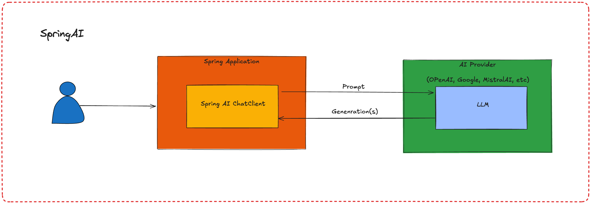

# **Crear Proyecto de Spring**

Para empezar, accedemos a [Spring initialzr](https://start.spring.io/) y configuramos el proyecto de la siguiente manera:

- **Project:** Maven
- **Language:** Java
- **Spring Boot:** 3.+ (la última versión estable)
- **Project Metadata:**
      - **Group:** com.geovannycodfigue
      - **Artifact:** bookstore
      - **Name:** bookstore
- **Packaging:** Jar
- **Java:** 21

## **Adicionar Dependencias**

Agregamos las siguientes dependencias en el archivo `pom.xml`:

### **Dependencias:**

