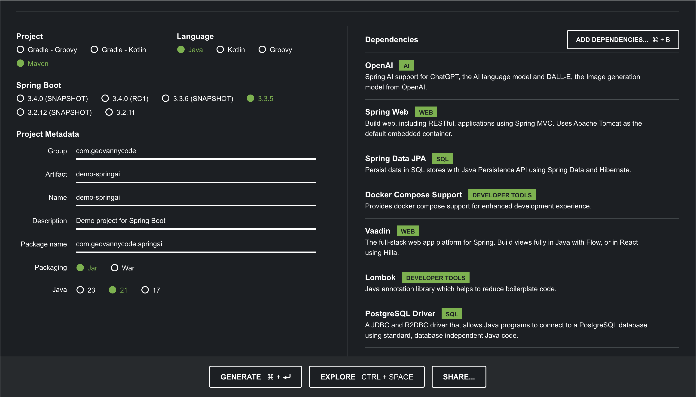

# **Configuración de Entorno**

## **Paso 1: Configuración del Proyecto en Spring Initializr**

Para comenzar, accede a [Spring initialzr](https://start.spring.io/) y configura el proyecto de la siguiente manera:

- **Project:** Maven
- **Language:** Java
- **Spring Boot:** 3.+ (la última versión estable)
- **Project Metadata:**
      - **Group:** com.geovannycode
      - **Artifact:** springai
      - **Name:** springai
- **Packaging:** Jar
- **Java:** 21

## **Paso 2: Adicionar Dependencias**

Agregamos las siguientes dependencias en el archivo `pom.xml`:



Agrega las siguientes dependencias en el archivo pom.xml para preparar tu proyecto. Cada dependencia tiene un propósito específico que te ayudará a lograr la funcionalidad deseada en el workshop.

1. **OpenAI** - `spring-ai-openai-spring-boot-starter`
Esta dependencia permite la integración de Spring AI con modelos de inteligencia artificial de OpenAI, incluyendo modelos como ChatGPT y DALL-E para generación de texto e imágenes. Con esta dependencia, podrás acceder a funcionalidades avanzadas de IA para agregar capacidades de generación de contenido a tu aplicación.

2. **Spring Web** - `spring-boot-starter-web`
Proporciona las herramientas necesarias para construir aplicaciones web, incluyendo API REST. Utiliza Spring MVC y Apache Tomcat como servidor web embebido, lo que facilita la creación de endpoints HTTP para que los usuarios puedan interactuar con tu aplicación a través de la web.

3. **Spring Data JPA** - `spring-boot-starter-data-jpa`
Esta dependencia te permite trabajar con bases de datos SQL de forma más eficiente mediante la API de Persistencia de Java (JPA). Proporciona herramientas para realizar operaciones CRUD (Crear, Leer, Actualizar, Eliminar) en tu base de datos, simplificando el acceso a datos y la persistencia.

4. **Docker Compose Support** - `spring-boot-docker-compose`
Esta dependencia facilita la configuración y gestión de contenedores Docker en tu proyecto. Al usar Docker Compose, puedes ejecutar múltiples servicios, como bases de datos, en contenedores, lo que facilita el despliegue de ambientes de desarrollo completos.

5. **Vaadin** - `vaadin-spring-boot-starter`
Vaadin es un framework para construir aplicaciones web modernas y reactivas con Java. Con esta dependencia, podrás crear interfaces de usuario de manera sencilla utilizando componentes visuales y vistas completamente en Java o integrando tecnologías como Hilla para un enfoque más dinámico.

6. **Lombok** - `lombok`
Lombok es una biblioteca que reduce el código repetitivo en Java, como getters, setters, y constructores. Es muy útil para simplificar el código y mantenerlo limpio y legible, especialmente en clases que necesitan muchas propiedades y métodos de acceso.

7. **PostgreSQL Driver** - `postgresql`
Proporciona el controlador JDBC para conectarse a una base de datos PostgreSQL, permitiendo la comunicación entre tu aplicación y la base de datos. Esta dependencia es esencial para almacenar y recuperar datos desde PostgreSQL.

8. **Spring Boot Starter Test** - `spring-boot-starter-test`
Incluye herramientas para pruebas unitarias e integradas en Spring Boot, como JUnit y Mockito. Esta dependencia es útil para asegurarte de que tu código funciona correctamente antes de desplegarlo.

## **Paso 3: Generación y Configuración del Proyecto**

Una vez configuradas todas las opciones y dependencias, presiona el botón "Generate" en Spring Initializr para generar el proyecto. Descarga el archivo .zip, descomprímelo y abre el proyecto en tu IDE preferido, como IntelliJ IDEA.

Con estas dependencias configuradas, estarás listo para comenzar a desarrollar la aplicación. A continuación, detallaré los pasos para configurar el entorno y explicaré cómo utilizar cada dependencia en el contexto del proyecto.

## **Paso 4: Crear los Paquetes**

Basado en tu estructura, necesitamos los siguientes paquetes:

1. **model**: Contendrá las clases de entidad o modelo.
2. **dto**: Aquí almacenaremos los objetos de transferencia de datos **(DTOs)** que utilizaremos para la comunicación entre el frontend y el backend.
3. **repo**: Este paquete contendrá las interfaces que representan los repositorios **(interfaces de JPA)** para interactuar con la base de datos.
4. **service**: Contendrá la lógica de negocio, dividiendo entre interfaces y sus implementaciones en el subpaquete `impl`.
5. **controller**: Este paquete contendrá los controladores para gestionar las solicitudes HTTP.

## **Paso 5: Paquete model**

En una aplicación que sigue la arquitectura MVC (Modelo-Vista-Controlador), el paquete `model` se encarga de representar el "Modelo" de datos de la aplicación. Aquí es donde definimos las clases que mapean las entidades de negocio que queremos almacenar y gestionar en nuestra base de datos.

En este caso, el paquete `com.geovannycode.model` contendrá las clases `Author` y `Book`, que representan respectivamente a los autores y libros en el contexto de nuestra aplicación. Estas clases de modelo (o entidades) serán mapeadas a tablas en la base de datos mediante las anotaciones de JPA (Java Persistence API), lo que nos permite trabajar con datos persistentes de una manera orientada a objetos.

En nuestro caso, el paquete `model` contendrá las clases `Author` y `Book`, que definirán los atributos y relaciones de las entidades "Autor" y "Libro", permitiéndonos interactuar con estos datos de manera estructurada y consistente.

```java title="Author.java" linenums="1"
import jakarta.persistence.Column;
import jakarta.persistence.Entity;
import jakarta.persistence.GeneratedValue;
import jakarta.persistence.GenerationType;
import jakarta.persistence.Id;
import lombok.AllArgsConstructor;
import lombok.Data;
import lombok.NoArgsConstructor;


@AllArgsConstructor
@NoArgsConstructor
@Entity
@Data
public class Author {

    @Id
    @GeneratedValue(strategy = GenerationType.IDENTITY)
    private int idAuthor;

    @Column(nullable = false, length = 50)
    private String firstName;

    @Column(nullable = false, length = 50)
    private String lastName;

    @Column(nullable = false, length = 35)
    private String country;

    @Column(nullable = false, length = 500)
    private String urlPhoto;
}
```

- **Líneas 11-12**: `@AllArgsConstructor` y `@NoArgsConstructor` Lombok genera un constructor con todos los argumentos y un constructor sin argumentos.
- **Líneas 13**: `@Entity` Indica que esta clase es una entidad de `JPA`, lo que significa que estará mapeada a una tabla en la base de datos.
- **Líneas 14**: `@Data`: Genera automáticamente getters, setters, y otros métodos como `toString()`, `equals()`, y `hashCode()`, gracias a Lombok.
- **Líneas 17-19**: `@Id` y `@GeneratedValue(strategy = GenerationType.IDENTITY)`: Configura idAuthor como la clave primaria y define que se generará automáticamente.
- **Líneas 21**: `@Column` Define restricciones para los campos de la entidad, como nullable, y establece límites de longitud para los atributos firstName, lastName, country, y urlPhoto.

```java title="Book.java" linenums="1"
import jakarta.persistence.Column;
import jakarta.persistence.Entity;
import jakarta.persistence.GeneratedValue;
import jakarta.persistence.GenerationType;
import jakarta.persistence.Id;
import jakarta.persistence.JoinColumn;
import jakarta.persistence.ManyToOne;
import lombok.AllArgsConstructor;
import lombok.Data;
import lombok.NoArgsConstructor;

@Data
@AllArgsConstructor
@NoArgsConstructor
@Entity
public class Book {
    @Id
    @GeneratedValue(strategy = GenerationType.IDENTITY)
    private int idBook;

    @Column(nullable = false, length = 50)
    private String name;

    @Column(nullable = false, length = 2000)
    private String review;

    @ManyToOne
    @JoinColumn(name = "id_author", nullable = false)
    private Author author;

    @Column(nullable = false, length = 500)
    private String urlCover;

    @Column(nullable = false)
    private boolean enabled;
}
```

- **Líneas 11-12**: `@Data`, `@AllArgsConstructor`, `@NoArgsConstructor`, `@Entity` Las mismas anotaciones y sus funciones, como en la clase Author.
- **Líneas 21**: `@Column` Define las restricciones de los campos, incluyendo `name`, `review`, y `urlCover`.
- **Líneas 27**: `@ManyToOne` y `@JoinColumn(name = "id_author", nullable = false)` Define una relación de muchos a uno con la clase `Author`, especificando que cada libro pertenece a un autor. `id_author` es la columna de clave externa en la base de datos que relaciona ambas entidades.
- **Líneas 35**: `boolean enabled` Este campo que representa si el libro está activo o no, con una restricción nullable = false para garantizar que siempre tenga un valor.

## **Paso 6: Paquete repo**

En la arquitectura de una aplicación basada en MVC, el paquete `repo`(abreviatura de "repository") es donde definimos las interfaces que se encargan de la interacción directa con la base de datos. Estas interfaces representan los "Repositorios" que permiten realizar operaciones CRUD (Crear, Leer, Actualizar, Eliminar) y consultas específicas en nuestras entidades de negocio (en este caso, `Author` y `Book`).

En este paquete, ubicaremos las interfaces `IAuthorRepo` e `IBookRepo`, las cuales extienden de `JpaRepository`. Esta extensión nos facilita la gestión de nuestras entidades mediante JPA, ya que hereda un conjunto de métodos predefinidos para realizar operaciones comunes sin tener que escribir código adicional.

### **Creación de las Interfaces IAuthorRepo e IBookRepo**

```java title="IAuthorRepo.java" linenums="1"
import com.geovannycode.model.Author;
import org.springframework.data.jpa.repository.JpaRepository;

public interface IAuthorRepo extends JpaRepository<Author, Integer> {}
```

- `IAuthorRepo`: Es una interfaz que extiende de JpaRepository, la cual está diseñada para la entidad `Author`.
- `JpaRepository<Author, Integer>`: Al extender de `JpaRepository`, estamos indicando que esta interfaz manejará la entidad `Author` con una clave primaria de tipo `Integer`. Esto nos proporciona métodos predeterminados para realizar operaciones CRUD en la tabla `Author`, como `findAll()`, `findById()`, `save()`, y `deleteById()`.

**Ventaja**: Spring Data JPA proporciona automáticamente la implementación de estos métodos, por lo que no necesitamos escribir código adicional para operaciones básicas en la entidad Author.

```java title="IBookRepo.java" linenums="1"
import com.geovannycode.model.Book;
import org.springframework.data.jpa.repository.JpaRepository;

import java.util.List;

public interface IBookRepo extends JpaRepository<Book, Integer> {
    List<Book> findByNameLike(String name);
}
```

- **Líneas 7**: `findByNameLike(String name)` Aquí hemos definido un método adicional para realizar una búsqueda personalizada. Este método busca libros cuyo nombre sea similar al parámetro `name` (utilizando el operador SQL `LIKE` internamente). La convención de nombre `findByNameLike`permite que Spring Data JPA implemente automáticamente el método sin que sea necesario escribir una consulta SQL explícita.

**Ventaja**: La capacidad de definir métodos personalizados con convenios de nomenclatura en las interfaces de repositorio hace que las consultas personalizadas sean fáciles de implementar y entender.

## **Paso 7: Paquete service**

La capa de servicio en la arquitectura de una aplicación MVC contiene la lógica de negocio. En esta capa, creamos interfaces y sus implementaciones que definen las operaciones que la aplicación realizará sobre las entidades de datos (`Author` y `Book`). Esta capa actúa como un intermediario entre los controladores (que reciben las solicitudes del usuario) y los repositorios (que interactúan con la base de datos).

En este caso, vamos a crear un enfoque genérico utilizando una interfaz llamada `ICRUD` que definirá los métodos CRUD (Crear, Leer, Actualizar, Eliminar) de forma genérica. Las interfaces específicas `IBookService` e `IAuthorService` extenderán de `ICRUD`, heredando así los métodos CRUD básicos.

**Interfaz Genérica `ICRUD`**
La interfaz ICRUD permite definir métodos genéricos para operaciones CRUD. Esto nos permite reutilizar esta interfaz para diferentes tipos de datos, en lugar de escribir métodos repetitivos en cada servicio específico.

```java title="ICRUD.java" linenums="1"
import java.util.List;

public interface ICRUD<T, ID> {

    T save(T t) throws Exception;
    List<T> saveAll(List<T> t) throws Exception;
    T update(T t, ID id) throws Exception;
    List<T> findAll() throws Exception;
    T findById(ID id) throws Exception;
    void delete(ID id) throws Exception;
}
```

`T` y `ID`: Son parámetros genéricos. `T` representa el tipo de entidad (como `Author` o `Book`), e `ID` representa el tipo de clave primaria (como `Integer`).

- **Métodos CRUD**:
      - `save(T t)`: Guarda una entidad en la base de datos.
      - `saveAll(List<T> t)`: Guarda una lista de entidades en la base de datos.
      - `update(T t, ID id)`: Actualiza una entidad existente con un ID específico.
      - `findAll()`: Devuelve todas las entidades.
      - `findById(ID id)`: Devuelve una entidad según el ID.
      - `delete(ID id)`: Elimina una entidad según el ID.

Al definir estos métodos de manera genérica, podemos reutilizar esta interfaz en cualquier clase de servicio que maneje entidades distintas, manteniendo así la consistencia y reduciendo el código duplicado.

### **Interfaz IBookService**

La interfaz `IBookService` extiende de `ICRUD` especificando que trabajará con la entidad `Book` y que el tipo de la clave primaria es `Integer`. Esto significa que `IBookService` hereda todos los métodos de `ICRUD` para operar con entidades `Book`.

```java title="IBookService.java" linenums="1"
import com.geovannycode.model.Book;

public interface IBookService extends ICRUD<Book, Integer> {
}
```

### **Interfaz IAuthorService**

Similar a `IBookService`, la interfaz `IAuthorService` extiende de `ICRUD`, especificando que trabajará con la entidad `Author` y que el tipo de la clave primaria es `Integer`. Al extender `ICRUD`, `IAuthorService` hereda todos los métodos para operar con entidades `Author`.

```java title="IAuthorService.java" linenums="1"
import com.geovannycode.model.Author;

public interface IAuthorService extends ICRUD<Author, Integer> {
}
```

Con las interfaces `IBookService` e `IAuthorService` creadas, estamos listos para implementar la lógica en sus clases correspondientes `(BookServiceImpl y AuthorServiceImpl)` dentro de la subcarpeta `impl`.

### **Implementaciones de Servicio**

Ambas clases (`AuthorServiceImpl` y `BookServiceImpl`) utilizan la anotación `@Service`, lo que indica que son componentes de servicio en Spring, y estarán disponibles como beans de Spring. Al implementar las interfaces de servicio (`IAuthorService` e `IBookService`), estas clases proporcionan la lógica de negocio para cada operación CRUD.

### **Uso de `@RequiredArgsConstructor`**

La anotación `@RequiredArgsConstructor` de Lombok genera un constructor que inicializa los atributos `final`, en este caso, `IAuthorRepo` para `AuthorServiceImpl` e `IBookRepo` para `BookServiceImpl`. Esto permite la inyección de dependencias de manera automática, ya que Spring inyectará los repositorios necesarios al crear instancias de estas clases.

```java title="AuthorServiceImpl.java" linenums="1"

import com.geovannycode.model.Author;
import com.geovannycode.repo.IAuthorRepo;
import com.geovannycode.service.IAuthorService;
import lombok.RequiredArgsConstructor;
import org.springframework.stereotype.Service;

import java.util.List;

@Service
@RequiredArgsConstructor
public class AuthorServiceImpl implements IAuthorService {

    private final IAuthorRepo repo;

    @Override
    public Author save(Author author) throws Exception {
        return repo.save(author);
    }

    @Override
    public List<Author> saveAll(List<Author> list) throws Exception {
        return repo.saveAll(list);
    }

    @Override
    public Author update(Author author, Integer id) throws Exception {
        if (repo.existsById(id)) {
            author.setIdAuthor(id);
            return repo.save(author);
        }
        throw new Exception("Author not found");
    }

    @Override
    public List<Author> findAll() throws Exception {
        return repo.findAll();
    }

    @Override
    public Author findById(Integer id) throws Exception {
        return repo.findById(id).orElse(new Author());
    }

    @Override
    public void delete(Integer id) throws Exception {
        repo.deleteById(id);
    }
}
```

- **Líneas 16**: `save(Author author)` Guarda un nuevo autor en la base de datos.
- **Líneas 21**: `saveAll(List<Author> list)` Guarda una lista de autores en la base de datos.
- **Líneas 26**: `update(Author author, Integer id)` Actualiza un autor existente. Primero verifica si el autor existe en la base de datos (`existsById(id)`). Si existe, actualiza el autor con el ID proporcionado; si no, lanza una excepción.
- **Líneas 35**: `findAll()` Devuelve todos los autores en la base de datos.
- **Líneas 40**: `findById(Integer id)` Busca un autor por su ID. Si no se encuentra, devuelve un objeto Author vacío.
- **Líneas 45**: `delete(Integer id)` Elimina un autor según su ID.

```java title="BookServiceImpl.java" linenums="1"

import com.geovannycode.model.Book;
import com.geovannycode.repo.IBookRepo;
import com.geovannycode.service.IBookService;
import lombok.RequiredArgsConstructor;
import org.springframework.stereotype.Service;

import java.util.List;

@Service
@RequiredArgsConstructor
public class BookServiceImpl implements IBookService {

    private final IBookRepo repo;

    @Override
    public Book save(Book book) throws Exception {
        return repo.save(book);
    }

    @Override
    public List<Book> saveAll(List<Book> list) throws Exception {
        return repo.saveAll(list);
    }

    @Override
    public Book update(Book book, Integer id) throws Exception {
        if (repo.existsById(id)) {
            book.setIdBook(id);
            return repo.save(book);
        }
        throw new Exception("Book not found");
    }

    @Override
    public List<Book> findAll() throws Exception {
        return repo.findAll();
    }

    @Override
    public Book findById(Integer id) throws Exception {
        return repo.findById(id).orElse(new Book());
    }

    @Override
    public void delete(Integer id) throws Exception {
        repo.deleteById(id);
    }
}
```

## **Paso 8: Paquete controller**

En la arquitectura MVC, la capa de controladores (o `controller`) es la que se encarga de recibir y manejar las solicitudes HTTP del cliente (como GET, POST, PUT, DELETE) y de devolver respuestas adecuadas. En este caso, implementaremos dos controladores: `AuthorController` y `BookController`, que gestionarán las operaciones CRUD para los autores y libros, respectivamente.

Ambos controladores están anotados con `@RestController`, lo que indica que son componentes de Spring MVC que procesan directamente las solicitudes HTTP y devuelven datos en formato JSON. Utilizamos `@RequestMapping` para definir el punto de entrada base para cada controlador (`/authors` y `/books`), y `@CrossOrigin` para permitir solicitudes CORS desde cualquier origen, lo cual es útil cuando el frontend y el backend están en diferentes dominios durante el desarrollo.

```java title="AuthorController.java" linenums="1"
import com.geovannycode.model.Author;
import com.geovannycode.service.IAuthorService;
import lombok.RequiredArgsConstructor;
import org.springframework.http.ResponseEntity;
import org.springframework.web.bind.annotation.*;

import java.net.URI;
import java.util.List;

@RestController
@RequestMapping("/authors")
@RequiredArgsConstructor
@CrossOrigin(origins = "*")
public class AuthorController {
    private final IAuthorService service;

    @GetMapping
    public ResponseEntity<List<Author>> findAll() throws Exception {
        return ResponseEntity.ok(service.findAll());
    }

    @GetMapping("/{id}")
    public ResponseEntity<Author> findById(@PathVariable("id") Integer id) throws Exception {
        return ResponseEntity.ok(service.findById(id));
    }

    @PostMapping
    public ResponseEntity<Author> save(@RequestBody Author author) throws Exception {
        Author obj = service.save(author);
        return ResponseEntity.created(URI.create("http://localhost:8080/authors/" + obj.getIdAuthor())).body(obj);
    }

    @PutMapping("/{id}")
    public ResponseEntity<Author> update(@RequestBody Author author, @PathVariable("id") Integer id) throws Exception {
        return ResponseEntity.ok(service.update(author, id));
    }

    @DeleteMapping("/{id}")
    public ResponseEntity<Void> deleteById(@PathVariable("id") Integer id) throws Exception {
        service.delete(id);
        return ResponseEntity.ok().build();
    }
}
```

- **@GetMapping**:
      - `findAll()`: Maneja las solicitudes GET en `/authors` y devuelve una lista de todos los autores en la base de datos.
      - `findById(Integer id)`: Maneja las solicitudes GET en `/authors/{id}` para obtener un autor por su ID.

- **@PostMapping**:
      - `save(Author author)`: Maneja las solicitudes POST en `/authors` para crear un nuevo autor.

- **@PutMapping**:
      - `update(Author author, Integer id)`: Maneja las solicitudes PUT en `/authors/{id}` para actualizar un autor existente. Si el autor se encuentra y se actualiza correctamente, devuelve la entidad actualizada.

- **@DeleteMapping**:
      - `deleteById(Integer id)`: Maneja las solicitudes DELETE en `/authors/{id}` para eliminar un autor por su ID. Retorna una respuesta vacía con código 200 (OK) si la eliminación es exitosa.

```java title=" BookController.java" linenums="1"

import com.geovannycode.model.Book;
import com.geovannycode.service.IBookService;
import lombok.RequiredArgsConstructor;
import org.springframework.http.ResponseEntity;
import org.springframework.web.bind.annotation.*;

import java.net.URI;
import java.util.List;

@RestController
@RequestMapping("/books")
@RequiredArgsConstructor
@CrossOrigin(origins = "*")
public class BookController {

    private final IBookService service;

    @GetMapping
    public ResponseEntity<List<Book>> findAll() throws Exception {
        return ResponseEntity.ok(service.findAll());
    }

    @GetMapping("/{id}")
    public ResponseEntity<Book> findById(@PathVariable("id") Integer id) throws Exception {
        return ResponseEntity.ok(service.findById(id));
    }

    @PostMapping
    public ResponseEntity<Book> save(@RequestBody Book book) throws Exception {
        Book obj = service.save(book);
        return ResponseEntity.created(URI.create("http://localhost:8080/books/" + obj.getIdBook())).body(obj);
    }

    @PutMapping("/{id}")
    public ResponseEntity<Book> update(@RequestBody Book book, @PathVariable("id") Integer id) throws Exception {
        return ResponseEntity.ok(service.update(book, id));
    }

    @DeleteMapping("/{id}")
    public ResponseEntity<Void> deleteById(@PathVariable("id") Integer id) throws Exception {
        service.delete(id);
        return ResponseEntity.ok().build();
    }
}
```

### **Explicaciones Adicionales**

1. **ResponseEntity**: 
      - Utilizamos `ResponseEntity` para construir la respuesta HTTP con el estado adecuado, permitiendo personalizar el cuerpo y los encabezados de la respuesta. Por ejemplo, en el método save, utilizamos `ResponseEntity.created(...)` para indicar que el recurso fue creado exitosamente.
2. **@CrossOrigin(origins = "*")**:
      - Esta anotación permite solicitudes desde cualquier origen, lo cual es útil para habilitar CORS (Cross-Origin Resource Sharing) en aplicaciones de frontend que se ejecutan en diferentes dominios o puertos durante el desarrollo. Puede ser configurada para limitar el origen de las solicitudes en un ambiente de producción.
3. **@PathVariable y @RequestBody**:
      - `@PathVariable` permite extraer variables de la URL, como el ID del autor o libro.
      - `@RequestBody` permite deserializar el cuerpo de la solicitud en un objeto Java. En este caso, se usa para recibir los datos de `Author` o `Book` en los métodos `save` y `update`.

## **Paso 9: Crear Archivos JSON en el Paquete resources/json**

Crea una carpeta llamada json dentro de `src/main/resources`, y luego agrega los archivos `authors.json` y `books.json` con el contenido proporcionado.

```json title="authors.json" linenums="1"
[
  {
    "firstName": "Geovanny",
    "lastName": "Mendoza",
    "country": "Colombia",
    "urlPhoto": "https://example.com/geovanny_photo.jpg"
  },
  {
    "firstName": "Otávio",
    "lastName": "Santana",
    "country": "Brasil",
    "urlPhoto": "https://example.com/otavio_photo.jpg"
  }
]
```

```json title="books.json" linenums="1"
[
  {
    "name": "Building Modern Web Applications With JakartaEE",
    "review": "Guía para crear aplicaciones modernas con JakartaEE, bases de datos NoSQL, MicroProfile y Vaadin.",
    "author": { "idAuthor": 1 },
    "urlCover": "https://example.com/building_modern_apps_cover.jpg",
    "enabled": true
  },
  {
    "name": "Mastering the Java Virtual Machine",
    "review": "Guía sobre el funcionamiento interno de la JVM, gestión de memoria y optimización del rendimiento.",
    "author": { "idAuthor": 2 },
    "urlCover": "https://example.com/mastering_jvm_cover.jpg",
    "enabled": true
  }
]
```

Estos archivos JSON contienen los datos iniciales de `Author` y `Book` que se cargarán automáticamente en la base de datos cuando se inicie la aplicación.

## **Paso 10: Configuración del Archivo `application.yml`**

En el archivo `application.yml`, ubicado en `src/main/resources`, agrega la siguiente configuración para establecer las propiedades de JPA y la clave API de OpenAI.

```yaml title="application.yml" linenums="1"
spring:
  jpa:
    hibernate:
      ddl-auto: create
    generate-ddl: true
    database-platform: org.hibernate.dialect.PostgreSQLDialect
  ai:
    openai:
      api-key: SPRING_AI_OPENAI_API_KEY
```

- **Líneas 1-4**: `spring.jpa.hibernate.ddl-auto create` Esta propiedad le indica a Hibernate que cree las tablas en la base de datos automáticamente al iniciar la aplicación.
- **Líneas 6**: `database-platform org.hibernate.dialect.PostgreSQLDialect` Especifica el dialecto de PostgreSQL para que Hibernate sepa cómo interactuar correctamente con la base de datos.
- **Líneas 7-9**: `ai.openai.api-key` Configura la clave API para acceder a los servicios de OpenAI. Reemplaza `SPRING_AI_OPENAI_API_KEY` con tu clave API de OpenAI.

## **Paso 11: Actualizar la Clase SpringaiApplication**

La clase `SpringaiApplication` debe implementar `ApplicationRunner` para cargar los datos de authors.json y books.json al inicio de la aplicación.

```java title="SpringaiApplication.java" linenums="1"

import com.fasterxml.jackson.core.type.TypeReference;
import com.fasterxml.jackson.databind.ObjectMapper;
import com.geovannycode.model.Author;
import com.geovannycode.model.Book;
import com.geovannycode.service.IAuthorService;
import com.geovannycode.service.IBookService;
import lombok.RequiredArgsConstructor;
import org.springframework.boot.ApplicationArguments;
import org.springframework.boot.ApplicationRunner;
import org.springframework.boot.SpringApplication;
import org.springframework.boot.autoconfigure.SpringBootApplication;
import org.springframework.core.io.Resource;
import org.springframework.core.io.ResourceLoader;
import org.springframework.util.FileCopyUtils;

import java.nio.charset.StandardCharsets;
import java.util.List;

@SpringBootApplication
@RequiredArgsConstructor
public class SpringaiApplication implements ApplicationRunner {

    private final ResourceLoader resourceLoader;
    private final IAuthorService authorService;
    private final IBookService bookService;

    public static void main(String[] args) {
        SpringApplication.run(SpringaiApplication.class, args);
    }

    @Override
    public void run(ApplicationArguments args) throws Exception {
        Resource resource1 = resourceLoader.getResource("classpath:json/authors.json");
        Resource resource2 = resourceLoader.getResource("classpath:json/books.json");

        // Leer el contenido del archivo JSON
        byte[] jsonData1 = FileCopyUtils.copyToByteArray(resource1.getInputStream());
        byte[] jsonData2 = FileCopyUtils.copyToByteArray(resource2.getInputStream());

        String jsonString1 = new String(jsonData1, StandardCharsets.UTF_8);
        String jsonString2 = new String(jsonData2, StandardCharsets.UTF_8);

        // Usar Jackson para convertir el JSON a objetos Java
        ObjectMapper objectMapper = new ObjectMapper();
        List<Author> authors = objectMapper.readValue(jsonString1, new TypeReference<List<Author>>(){});
        List<Book> books = objectMapper.readValue(jsonString2, new TypeReference<List<Book>>(){});

        // Guardar los datos en la base de datos
        authorService.saveAll(authors);
        bookService.saveAll(books);
    }
}
```

- **Líneas 19**:`@SpringBootApplication` Anota la clase principal como una aplicación Spring Boot.
- **Líneas 19**: `@RequiredArgsConstructor` Genera un constructor para inyectar las dependencias ResourceLoader, IAuthorService, e `IBookService`.
- **Líneas 19**: `run(ApplicationArguments args)` Este método se ejecuta al iniciar la aplicación.
- **Líneas 19**: `Cargar archivos JSON` Usa ResourceLoader para obtener los archivos `authors.json` y `books.json`.
- **Líneas 19**: `Leer el contenido` Utiliza `FileCopyUtils` para leer el contenido de los archivos JSON en `byte[]` y luego los convierte a `String`.
- **Líneas 19**: `Convertir JSON a objetos Java` Usa `ObjectMapper` de Jackson para convertir el JSON en listas de objetos `Author` y `Book`.
- **Líneas 19**: `Guardar en la base de datos` Utiliza `authorService` y `bookService` para guardar los datos en la base de datos.

Para facilitar el inicio del taller y omitir la configuración inicial del entorno, puedes descargar el proyecto base desde el repositorio de GitHub en la rama `01_Structure_Project`. Esto te permitirá comenzar directamente con el código y la estructura básica del proyecto ya configurados.

### **Descarga del Proyecto Base**

Puedes acceder al proyecto en la siguiente URL:

🔗 [Ejemplo SpringAI](https://github.com/geovannymcode/springai/tree/01_Structure_Project)

Esta rama incluye toda la estructura inicial del proyecto, permitiéndote enfocarte en el desarrollo de las funcionalidades de IA generativa sin preocuparte por la configuración básica del entorno.