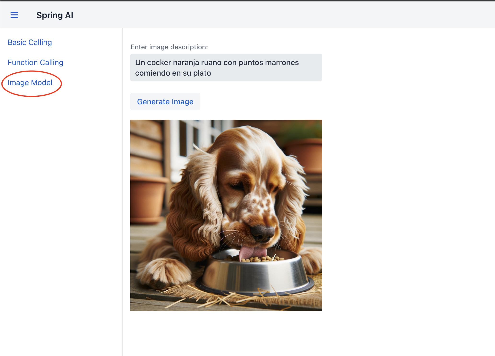

# **Image Model**

## **Contexto de DALL-E en OpenAI**

**DALL-E** es un modelo de generación de imágenes desarrollado por OpenAI que permite crear imágenes a partir de descripciones textuales. En este proyecto, utilizamos la versión DALL-E 3, que se caracteriza por su alta calidad y capacidad para comprender descripciones complejas. La integración con Spring AI permite que DALL-E se use como un servicio de generación de imágenes en aplicaciones de Java.

## **Paso 1: Controlador ImageController**

El controlador `ImageController` expone un endpoint que permite generar una imagen a partir de una descripción textual.

```java title="FunctionConfig.java" linenums="1"
@RestController
@RequestMapping("/images")
@RequiredArgsConstructor
@CrossOrigin(origins = "*")
public class ImageController {

    private final OpenAiImageModel openAiImageModel;

    @GetMapping("/generate")
    public ResponseEntity<ResponseDTO<String>> generateImage(@RequestParam("param") String param) {
        ImageResponse imageResponse = openAiImageModel.call(new ImagePrompt(param,
                OpenAiImageOptions.builder()
                        .withModel("dall-e-3")
                        .withQuality("hd")
                        .withN(1) //cantidad de imagenes a generar, dall-e-3 solo permite n=1
                        .withHeight(1024)
                        .withWidth(1024)
                        .build()
        ));

        String url = imageResponse.getResult().getOutput().getUrl();

        return ResponseEntity.ok(new ResponseDTO<>(200, "success", url));
    }
}
```

- **Línea 1** `@RestController`: Define que esta clase es un controlador de Spring que manejará solicitudes HTTP y devolverá respuestas en formato JSON.

- **Línea 2** `@RequestMapping("/images")`: Define la ruta base del controlador como /images. Todas las rutas dentro de este controlador estarán bajo esta URL base.

- **Línea 3** `@RequiredArgsConstructor`: Genera un constructor que inicializa los campos final en la clase. En este caso, inyecta OpenAiImageModel, que representa el modelo de generación de imágenes de OpenAI.

- **Línea 4** `@CrossOrigin(origins = "*")`: Permite que cualquier origen realice solicitudes a este controlador. Es útil para aplicaciones de frontend que se ejecutan en dominios diferentes.

- **Línea 9** `@GetMapping("/generate")`: Define el endpoint /images/generate, que responderá a solicitudes GET. Este endpoint generará una imagen basada en una descripción proporcionada por el usuario.

- **Línea 10** `public ResponseEntity<ResponseDTO<String>> generateImage(@RequestParam("param") String param)`: Método que toma un parámetro de consulta param (la descripción de la imagen) y devuelve una respuesta JSON con la URL de la imagen generada.

- **Línea 11** 
    - `openAiImageModel.call(...)`: Llama al modelo de generación de imágenes con los parámetros especificados.
    - `new ImagePrompt(param, ...)`: Crea un ImagePrompt, que contiene la descripción de la imagen (param) y las opciones de generación.

- **Líneas 12-17** `OpenAiImageOptions.builder()`: Configura las opciones de generación de la imagen:
     - `withModel("dall-e-3")`: Especifica que se usará el modelo dall-e-3.
     - `withQuality("hd")`: Configura la calidad de la imagen en "hd" (alta definición).
     - `withN(1)`: DALL-E solo permite generar una imagen por solicitud, así que n=1.
     - `withHeight(1024) y withWidth(1024)`: Define el tamaño de la imagen como 1024x1024 píxeles.

- **Línea 21** `String url = imageResponse.getResult().getOutput().getUrl();`: Extrae la URL de la imagen generada de la respuesta.
- **Línea 23** `return ResponseEntity.ok(new ResponseDTO<>(200, "success", url));`: Devuelve una respuesta con estado HTTP 200 y un ResponseDTO que contiene la URL de la imagen generada.

## **Paso 2: Integración en Vaadin `Image Model`**

Este formulario como se puede observar en la **figura #1** es de generación de imágenes, por lo cual permite al usuario ingresar una descripción en texto y, al hacer clic en "Generate Image", se envía una solicitud al backend. El backend procesa esta solicitud con DALL-E y devuelve una URL de la imagen generada, que se muestra automáticamente en el contenedor de la interfaz.



**Figura #1: Formulario de Generación de Image**

### **Paso 2.1: Creación de Formulario en Vaadin**

```java title="ImageGeneratorView.java" linenums="1"
@Route("image-generator")
@Menu(title = "Image Model", order = 3)
public class ImageGeneratorView extends VerticalLayout {

    private final RestTemplate restTemplate = new RestTemplate();
    private final String backendUrl = "http://localhost:8080/images/generate";

    public ImageGeneratorView() {
        setSizeFull();

        // Campo de texto para ingresar la descripción de la imagen
        TextArea descriptionInput = new TextArea("Enter image description:");
        descriptionInput.setWidth("400px");

        // Botón para generar la imagen
        Button generateButton = new Button("Generate Image");

        // Contenedor de la imagen
        Image imageDisplay = new Image();
        imageDisplay.setWidth("400px"); // Ajusta el ancho de la imagen
        imageDisplay.setHeight("400px");

        generateButton.addClickListener(click -> {
            String description = descriptionInput.getValue();
            String url = backendUrl + "?param=" + description;

            // Llamada al backend para obtener la URL de la imagen
            ResponseEntity<ResponseDTO<String>> responseEntity = restTemplate.exchange(
                    url,
                    HttpMethod.GET,
                    null,
                    new ParameterizedTypeReference<ResponseDTO<String>>() {}
            );

            if (responseEntity.getStatusCode().is2xxSuccessful() && responseEntity.getBody() != null) {
                String imageUrl = responseEntity.getBody().getData(); // URL de la imagen generada
                imageDisplay.setSrc(imageUrl); // Mostrar la imagen en el componente Image
            } else {
                Notification.show("Error: Failed to generate image.");
            }
        });

        add(descriptionInput, generateButton, imageDisplay);
    }
}
```

- **Línea 1** `@Route("image-generator")`: Define la ruta de esta vista como /image-generator. Esto permite acceder a la vista a través de esta URL.

- **Línea 2** `@Menu(title = "Image Model", order = 3)`: Añade esta vista al menú lateral con el título "Image Model" y la coloca en la tercera posición.

- **Línea 3** `public class ImageGeneratorView extends VerticalLayout`: La clase ImageGeneratorView extiende VerticalLayout de Vaadin, que permite organizar los componentes en una disposición vertical.

- **Línea 5** `RestTemplate restTemplate`: Cliente de Spring para hacer solicitudes HTTP al backend.

- **Línea 6** `String backendUrl`: Define la URL del endpoint en el backend (`/images/generate`) al que se enviarán las solicitudes para generar la imagen.

- **Línea 9** `setSizeFull()`: Configura el diseño para ocupar todo el espacio disponible en la ventana.

- **Línea 12** `TextArea descriptionInput`: Campo de entrada donde el usuario puede escribir la descripción de la imagen que desea generar.

- **Línea 13** `descriptionInput.setWidth("400px")`: Establece el ancho del campo de texto en 400 píxeles para mejorar la experiencia visual del usuario.

- **Línea 16** `Button generateButton`: Botón que, al hacer clic, iniciará el proceso de generación de la imagen llamando al backend.

- **Línea 19** `Image imageDisplay`: Componente de Vaadin para mostrar la imagen generada.
- **Líneas 20-21** `imageDisplay.setWidth("400px") y imageDisplay.setHeight("400px")`: Configura el tamaño del contenedor de la imagen en 400x400 píxeles para que la imagen generada se ajuste visualmente al espacio asignado.

- **Líneas 23-25** `generateButton.addClickListener`: Define la acción que ocurre al hacer clic en el botón "Generate Image".
    - `descriptionInput.getValue()`: Obtiene la descripción ingresada por el usuario.
    - `url`: Construye la URL de la solicitud al backend, agregando el parámetro param con la descripción de la imagen.

- **Líneas 28-32** 
    - `restTemplate.exchange(...)`: Realiza una solicitud GET al backend para obtener la URL de la imagen generada.
    - `new ParameterizedTypeReference<ResponseDTO<String>>() {}`: Permite manejar la respuesta como un ResponseDTO con un String que contiene la URL de la imagen.

- **Línea 35-40** `Validación de la Respuesta`:
    - Verifica que la respuesta sea exitosa (`2xx`) y que el cuerpo de la respuesta no sea nulo.
    - `String imageUrl = responseEntity.getBody().getData();`: Extrae la URL de la imagen generada.
    - `imageDisplay.setSrc(imageUrl);`: Establece la URL de la imagen en el componente imageDisplay, lo que hace que la imagen se cargue y muestre en la interfaz.
    - Si la solicitud falla, se muestra una notificación de error al usuario.

- **Línea 43** `add(descriptionInput, generateButton, imageDisplay);`: Añade los componentes (`descriptionInput`, `generateButton`, y `imageDisplay`) a la vista para que se muestren en la interfaz.

## **Resumen**

- **ImageController**: Generar imágenes basadas en descripciones textuales, lo que resulta útil para crear contenido visual personalizado a partir de texto. Utilizando DALL-E, el controlador convierte cualquier descripción en una imagen de alta calidad que se puede mostrar en la interfaz de usuario.

La **integración de Vaadin como interfaz de frontend** permite a los usuarios interactuar de forma sencilla y visual con estas funcionalidades de IA. Con Vaadin, se crean formularios dinámicos para ingresar descripciones de imágenes y cargar imágenes, lo que mejora la experiencia de usuario al permitir la visualización instantánea de los resultados generados por DALL-E. Esta combinación entre **DALL-E, el modelo de chat de OpenAI, Spring AI y Vaadin** demuestra cómo se pueden utilizar modelos avanzados de IA en aplicaciones interactivas y visuales, integrando tanto procesamiento de texto como de imagen para crear aplicaciones enriquecidas y centradas en el usuario.