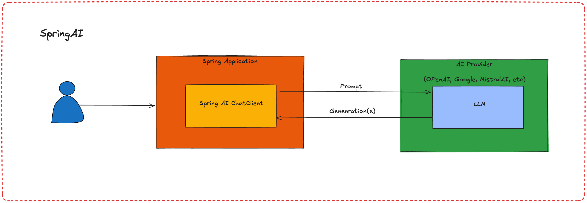

# **IA Generativa en Acción: Spring AI con OpenAI, Java 21 y Vaadin**

## **Descripción del Taller**

En este taller interactivo, aprenderás paso a paso cómo trabajar con la IA Generativa desde cero usando Spring AI con OpenAI, Java 21 y Vaadin. Exploraremos el proceso de generación de textos, imágenes y audios en una aplicación frontend construida con Vaadin. Este taller está diseñado para aquellos que buscan dominar las herramientas de Spring AI y Vaadin y quieren integrar inteligencia artificial en aplicaciones modernas. Al final del taller, tendrás una aplicación funcional y un conocimiento práctico de cómo utilizar modelos de lenguaje de gran tamaño (LLM) en un entorno de producción.

## **Introducción**

La inteligencia artificial generativa está transformando la manera en que interactuamos con la tecnología. En este taller, exploraremos el potencial de Spring AI y OpenAI junto con Java 21 y Vaadin para crear una aplicación que aproveche los modelos de lenguaje de gran tamaño (LLM) para la generación de textos, imágenes y audios. Este taller es ideal para aquellos interesados en aprender a integrar IA generativa en aplicaciones web y dominar el uso de Spring AI para construir aplicaciones modernas, interactivas y enriquecidas con funcionalidades de IA.

## **Requisitos**

- **Java**: Versión 21.
- **Spring Boot**: Versión 3.2.x o superior.
- **Base de Datos**: PostgreSQL.
- **IDE (Entorno de Desarrollo Integrado)**: IntelliJ IDEA, Eclipse, o cualquier otro de tu preferencia.
- **Herramientas de Construcción**: Maven o Gradle.
- **Docker**: Utilizado para la creación y gestión de contenedores, facilitando un entorno de desarrollo consistente y fácil de replicar.

## **Diagrama de la Aplicación**

## **Descripción del Diagrama de la Aplicación**

El diagrama muestra una vista general de la arquitectura técnica y el flujo de comunicación entre los componentes en la aplicación de IA generativa:

1. **Usuario**: El usuario envía una solicitud o "prompt" a la aplicación a través de una interfaz frontend desarrollada con Vaadin. La solicitud puede ser para generar texto, imágenes o audios.

2. **Aplicación Spring**: Esta es la capa backend construida en Spring Boot y contiene el componente Spring AI ChatClient. Este componente actúa como el intermediario entre la aplicación y los servicios de IA. Su principal tarea es recibir el prompt del usuario, procesarlo, y luego comunicarse con un proveedor de IA para obtener la respuesta generada.

3. **Spring AI ChatClient**: Este componente dentro de la aplicación Spring se encarga de construir la solicitud y enviar el prompt al proveedor de IA (como OpenAI). También maneja la respuesta generada por el proveedor de IA y la envía de vuelta a la interfaz de usuario.

4. **Proveedor de IA (AI Provider)**: Este es el servicio externo (por ejemplo, OpenAI, Google, MistralAI, etc.) que contiene el LLM (Large Language Model). Recibe el prompt desde el Spring AI ChatClient, genera el contenido solicitado (texto, imágenes o audios) y lo devuelve a la aplicación Spring.

5. **LLM (Large Language Model)**: Es el modelo de IA generativa que procesa el prompt y produce una respuesta. Dependiendo del tipo de solicitud, el LLM puede generar contenido de diferentes formatos y complejidades.
