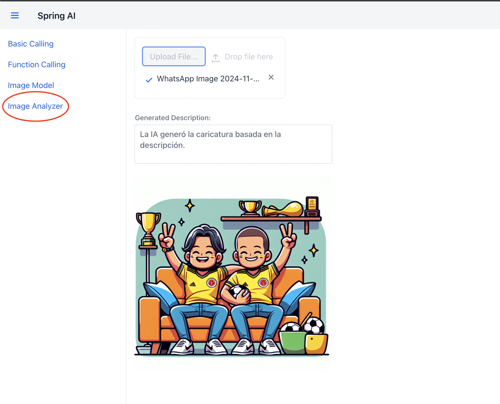

# **Multi Modality**

La multimodalidad permite que los modelos de IA procesen y generen contenido basado en diferentes tipos de datos, como texto e imágenes, y los combinen para proporcionar respuestas complejas y enriquecidas. En este caso, el modelo puede interpretar una imagen cargada, generar una descripción textual sobre lo que contiene y luego producir una caricatura en base a esa descripción. La capacidad de analizar y generar contenido a partir de múltiples modalidades (texto e imagen) demuestra el potencial de la IA para realizar tareas más avanzadas y sofisticadas que responden a interacciones humanas complejas.

## **Paso 1: Controlador MultiModalityController**

Este controlador permite realizar análisis multimodal. El usuario carga una imagen, el modelo describe su contenido, y luego se genera una caricatura basada en esa descripción.

```java title="MultiModalityController.java" linenums="1"
@RestController
@RequestMapping("/multis")
@RequiredArgsConstructor
public class MultiModalityController {

    private final OpenAiChatModel openAiChatModel;
    private final OpenAiImageModel openAiImageModel;

    @PostMapping("/upload")
    public String multiModalityUpload(@RequestParam("image") MultipartFile imageFile) throws Exception{
        UserMessage userMessage = new UserMessage(
                "Explicame que ves en esta imagen?",
                List.of(new Media(MimeTypeUtils.IMAGE_JPEG, new ByteArrayResource(imageFile.getBytes())))
        );

        ChatResponse response = openAiChatModel.call(new Prompt(List.of(userMessage)));
        String description = response.getResult().getOutput().getContent();

        String url = openAiImageModel.call(new ImagePrompt("Generame una caricatura de esta descripcion: " + description,
                OpenAiImageOptions.builder()
                        .withModel("dall-e-3")
                        .withQuality("standard")
                        .withN(1)
                        .withHeight(1024)
                        .withWidth(1024)
                        .build()
        )).getResult().getOutput().getUrl();

        return url;
    }
}
```

- **Línea 1** `@RestController`: Define el controlador como un manejador de solicitudes HTTP en formato JSON.

- **Línea 2** `@RequestMapping("/multis")`: Define la ruta base del controlador como /multis.

- **Línea 3** `@RequiredArgsConstructor`: Genera un constructor que inyecta OpenAiChatModel y OpenAiImageModel.

- **Línea 9** `@GetMapping("/upload")`: Define el endpoint /multis/upload, que responderá a solicitudes GET para procesar imágenes.

- **Línea 10** `public String multiModalityUpload(@RequestParam("image") MultipartFile imageFile) throws Exception`: Método que toma una imagen como entrada y devuelve la URL de la caricatura generada.

- **Línea 11** `new UserMessage(...)`: Crea un mensaje de usuario pidiendo al modelo que describa el contenido de la imagen cargada.

- **Línea 13** 
     - `List.of(new Media(...))`: Adjunta la imagen cargada como un recurso (Media) en formato JPEG.
     - `new ByteArrayResource(imageFile.getBytes())`: Convierte el archivo de imagen en un recurso de bytes para enviarlo al modelo.

- **Línea 16** `openAiChatModel.call(...)`: Llama al modelo de chat para procesar el mensaje del usuario y obtener una descripción de la imagen.

- **Línea 17** `String description = response.getResult().getOutput().getContent();`: Extrae la descripción generada por el modelo a partir de la imagen cargada.

- **Línea 19** 
     - `openAiImageModel.call(...)`: Llama nuevamente al modelo de generación de imágenes para crear una caricatura basada en la descripción obtenida.
     - `new ImagePrompt("Generame una caricatura de esta descripcion: " + description, ...)`: Crea un ImagePrompt con la descripción generada en el paso anterior.

- **Líneas 21-25** `withModel("dall-e-3"), withQuality("standard"), withN(1), withHeight(1024), withWidth(1024)`: Configura las opciones para la generación de la caricatura, similar al controlador anterior.

- **Línea 27** `getResult().getOutput().getUrl()`: Obtiene la URL de la caricatura generada.

- **Línea 29** `return url;`: Devuelve la URL de la caricatura generada como respuesta.

## **Paso 2: Integración en Vaadin `MultiModality`**

Este formulario permite a los usuarios cargar una imagen y recibir una descripción generada automáticamente por la IA, junto con una caricatura basada en esa descripción. La interfaz está compuesta por varios elementos clave que guían al usuario a lo largo del proceso de carga y visualización del contenido generado:

- **Campo de Carga de Imagen**:
El usuario puede arrastrar y soltar una imagen o hacer clic en el botón "Upload File..." para seleccionar una imagen desde su dispositivo. Solo se aceptan imágenes en formato JPEG o PNG, con un tamaño máximo de 5 MB.
- **Área de Descripción Generada**:
Una vez cargada y procesada la imagen, se muestra aquí una breve descripción generada por el modelo de IA sobre el contenido de la imagen. Esta área está configurada como solo lectura, permitiendo que el usuario visualice la descripción sin editarla.
- **Visualización de la Caricatura Generada**:
La IA crea una caricatura basada en la descripción de la imagen original. Esta caricatura se presenta en la parte inferior del formulario, ofreciendo al usuario una versión ilustrada y estilizada del contenido.
- **Interactividad**:
Después de cargar una imagen, el sistema envía la imagen al backend, donde es procesada por el modelo de IA. La IA primero analiza la imagen para generar una descripción y, a partir de esa descripción, crea una caricatura que se devuelve y se muestra al usuario en la interfaz.
- **Experiencia de Usuario**:
Este formulario está diseñado para ser intuitivo, guiando al usuario paso a paso en la carga y visualización de la imagen y sus resultados. Cada componente está dispuesto en un diseño vertical que mantiene la interfaz limpia y fácil de usar.
Como se muestra en la **Figura #1**, el formulario permite a los usuarios interactuar con las capacidades de la IA de manera visual, obteniendo un análisis descriptivo y una caricatura de la imagen subida.



**Figura #1: Formulario de Generación de Image**

```java title="MultiModalityView.java" linenums="1"
@Route("image-analyzer")
@Menu(title = "Image Analyzer", order = 4)
public class MultiModalityView extends VerticalLayout {
    private final RestTemplate restTemplate = new RestTemplate();
    private final String backendUrl = "http://localhost:8080/multis/upload";

    public MultiModalityView() {
        setSizeFull();

        // Componente para la carga de imagen
        Upload upload = new Upload();
        upload.setMaxFiles(1);
        upload.setAcceptedFileTypes("image/jpeg", "image/png");
        upload.setMaxFileSize(5 * 1024 * 1024); // Límite de 5 MB para la imagen

        // Contenedor de bytes para almacenar la imagen cargada
        ByteArrayOutputStream uploadBuffer = new ByteArrayOutputStream();

        upload.setReceiver((fileName, mimeType) -> {
            uploadBuffer.reset();
            return uploadBuffer;
        });

        Image imageDisplay = new Image();
        imageDisplay.setWidth("400px");
        imageDisplay.setHeight("400px");

        TextArea descriptionArea = new TextArea("Generated Description:");
        descriptionArea.setWidth("400px");
        descriptionArea.setHeight("100px");
        descriptionArea.setReadOnly(true);

        upload.addSucceededListener(event -> {
            try {
                HttpHeaders headers = new HttpHeaders();
                headers.setContentType(MediaType.MULTIPART_FORM_DATA);

                MultiValueMap<String, Object> body = new LinkedMultiValueMap<>();
                body.add("image", new ByteArrayResource(uploadBuffer.toByteArray()) {
                    @Override
                    public String getFilename() {
                        return event.getFileName();
                    }
                });

                HttpEntity<MultiValueMap<String, Object>> requestEntity = new HttpEntity<>(body, headers);

                // Envía la solicitud POST al backend
                ResponseEntity<String> responseEntity = restTemplate.postForEntity(backendUrl, requestEntity, String.class);

                if (responseEntity.getStatusCode().is2xxSuccessful() && responseEntity.getBody() != null) {
                    String imageUrl = responseEntity.getBody();
                    imageDisplay.setSrc(imageUrl);
                    descriptionArea.setValue("La IA generó la caricatura basada en la descripción.");
                } else {
                    Notification.show("Error: Failed to analyze image.");
                }
            } catch (Exception e) {
                Notification.show("Error: " + e.getMessage());
            }
        });

        add(upload, descriptionArea, imageDisplay);
    }
}
```

- **Línea 1** `@Route("image-analyzer")`: Define la ruta en la aplicación para acceder a esta vista. Aquí, el usuario accederá a esta funcionalidad en la URL `/image-analyzer`.
- **Línea 2** `@Menu(title = "Image Analyzer", order = 4)`: Agrega la vista al menú de navegación de la aplicación con el título "Image Analyzer" y la posiciona en el cuarto lugar.
- **Línea 3** `public class MultiModalityView extends VerticalLayout`: Declara la clase MultiModalityView, que extiende VerticalLayout de Vaadin, para organizar los componentes verticalmente.
- **Línea 4** `RestTemplate restTemplate`: Instancia de RestTemplate para realizar llamadas HTTP al backend.
- **Línea 5** `backendUrl`: URL del endpoint del backend para cargar y analizar la imagen.
- **Línea 7** `public MultiModalityView()`: Constructor de la clase donde se inicializan los componentes de la vista.
- **Línea 8** `setSizeFull()`: Configura el tamaño de la vista para que ocupe todo el espacio disponible.
- **Línea 11** `Upload upload = new Upload()`: Crea un componente Upload para que el usuario pueda cargar una imagen.
- **Línea 12** `upload.setMaxFiles(1)`: Limita la cantidad de archivos que se pueden cargar a uno solo.
- **Línea 13** `upload.setAcceptedFileTypes("image/jpeg", "image/png")`: Especifica los tipos de archivos aceptados: JPEG y PNG.
- **Línea 14** `upload.setMaxFileSize(5 * 1024 * 1024)`: Limita el tamaño máximo del archivo a 5 MB.
- **Línea 17** `uploadBuffer`: Almacena temporalmente el archivo de imagen cargado en memoria para enviarlo al backend.
- **Línea 19** `upload.setReceiver(...)`: Configura el receptor para el archivo cargado. Cada vez que se carga una imagen, se borra el contenido de uploadBuffer y se usa para almacenar el nuevo archivo.
- **Línea 24** `Image imageDisplay = new Image()`: Crea un componente Image que se usará para mostrar la imagen generada por el backend.
- **Línea 25** `imageDisplay.setWidth("400px")`: Configura el ancho de la imagen a 400 píxeles.
- **Línea 26** `imageDisplay.setHeight("400px")`: Configura la altura de la imagen a 400 píxeles.

- **Línea 28** `TextArea descriptionArea`: Crea un área de texto para mostrar la descripción generada por el modelo de IA sobre el contenido de la imagen.
- **Línea 31** `descriptionArea.setReadOnly(true)`: Configura el área de texto como solo lectura para que el usuario no pueda editar la descripción generada.
- **Línea 33** `upload.addSucceededListener(...)`: Agrega un SucceededListener que se ejecuta después de que se carga correctamente el archivo.
- **Línea 35** `HttpHeaders headers`: Crea encabezados HTTP para la solicitud.
- **Línea 36** `headers.setContentType(...)`: Establece el tipo de contenido como multipart/form-data para enviar el archivo al backend.

- **Línea 38** `MultiValueMap<String, Object> body`: Crea un mapa de valores para almacenar el contenido de la solicitud.
- **Línea 39** `body.add("image", new ByteArrayResource(...))`: Agrega la imagen cargada al cuerpo de la solicitud como un recurso de byte.
- **Línea 42** `getFilename()`: Devuelve el nombre del archivo cargado.
- **Línea 46** `HttpEntity<MultiValueMap<String, Object>> requestEntity`: Crea la entidad HTTP que contiene tanto el cuerpo de la solicitud como los encabezados.
- **Línea 49** `ResponseEntity<String> responseEntity`: Envía la solicitud POST al backend y recibe la respuesta.
- **Línea 51** `if (responseEntity.getStatusCode().is2xxSuccessful()...)`: Verifica si la solicitud fue exitosa.
- **Línea 52** `String imageUrl = responseEntity.getBody()`: Extrae la URL de la imagen generada de la respuesta.
- **Línea 53** `imageDisplay.setSrc(imageUrl)`: Establece la URL como fuente de imageDisplay para mostrar la imagen.
- **Línea 54** `descriptionArea.setValue(...)`: Muestra un mensaje en el área de texto, informando al usuario que se ha generado la caricatura.
- **Línea 58** `catch (Exception e)`: Maneja cualquier excepción que ocurra durante el proceso de carga y muestra un mensaje de error al usuario.
- **Línea 63** `add(...)`: Agrega los componentes de carga de imagen, área de descripción y visualización de imagen a la vista MultiModalityView.

## **Resumen**

- **MultiModalityController**: Procesar imágenes y generar una respuesta descriptiva, además de producir una caricatura basada en esa descripción, demostrando el potencial de la IA multimodal para tareas de generación de imágenes y análisis visual. Este controlador combina la capacidad de reconocimiento visual del modelo de chat con la generación de contenido visual de DALL-E, proporcionando una experiencia completa de análisis e interacción con imágenes.