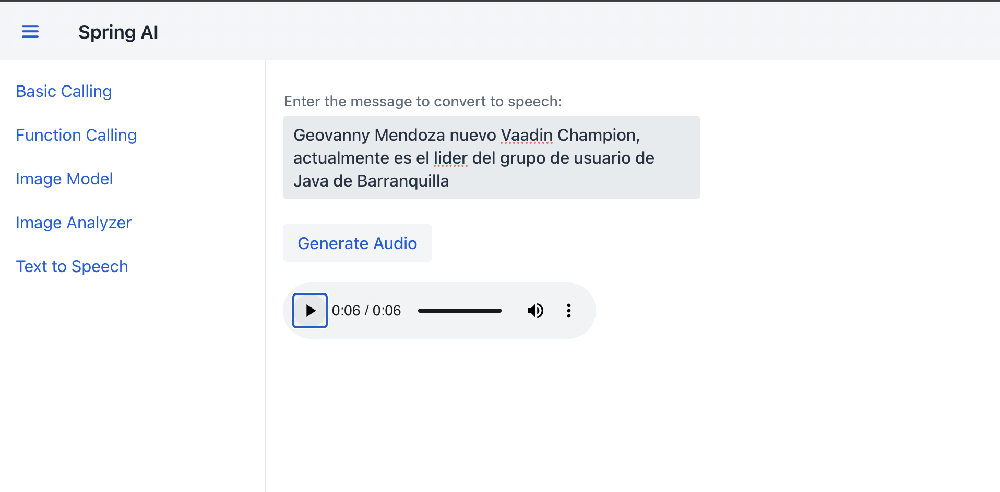

# **Text to Speech**

## **Descripción del TTS (Text-to-Speech) en OpenAI con Spring AI**

El uso de **Text-to-Speech (TTS)** en OpenAI, integrado con Spring AI, permite convertir texto a voz, generando archivos de audio a partir de mensajes escritos. Esta funcionalidad tiene un impacto significativo en aplicaciones donde la accesibilidad, la interacción con el usuario y la experiencia de usuario son esenciales. Con TTS, se pueden crear experiencias interactivas que benefician a usuarios con discapacidades visuales o aquellos que prefieren consumir información de manera auditiva.

Al integrar **OpenAI TTS con Spring AI**, se obtiene:

- **Accesibilidad Mejorada**: Proporciona opciones de accesibilidad para usuarios que tienen dificultades para leer texto.
- **Interacción Natural**: Facilita experiencias más humanas y naturales en aplicaciones interactivas, como asistentes virtuales o chatbots, al permitir respuestas en formato de voz.
- **Aplicaciones Multimedia**: Aumenta el alcance de aplicaciones de entretenimiento, educación y productividad que requieren elementos de voz generados automáticamente.
- **Multimodalidad**: Complementa otras modalidades de IA, como la generación de texto o de imágenes, creando aplicaciones ricas en características multimedia.

Esta funcionalidad también simplifica el flujo de trabajo al automatizar la generación de audios, eliminando la necesidad de grabaciones manuales y permitiendo respuestas rápidas a mensajes personalizados. En conjunto, OpenAI y Spring AI facilitan la integración de modelos avanzados de IA en aplicaciones Java de una manera escalable y eficiente, convirtiendo texto en audio con solo unos pocos pasos y logrando una experiencia de usuario mucho más envolvente y accesible.

## **Paso 1: Controlador TtsController**

Este controlador recibe un mensaje de texto como entrada y devuelve un archivo de audio MP3 generado a partir del mensaje.

```java title="TtsController.java" linenums="1"
@RestController
@RequestMapping("/tts")
@RequiredArgsConstructor
public class TtsController {

    private final OpenAiAudioSpeechModel openAiAudioSpeechModel;

    @GetMapping(produces = MediaType.APPLICATION_OCTET_STREAM_VALUE)
    public ResponseEntity<byte[]> tts(@RequestParam("message") String message) throws Exception {
        OpenAiAudioSpeechOptions speechOptions = OpenAiAudioSpeechOptions.builder()
                .withResponseFormat(OpenAiAudioApi.SpeechRequest.AudioResponseFormat.MP3)
                .withVoice(OpenAiAudioApi.SpeechRequest.Voice.NOVA)
                .withSpeed(1.0f)
                .withModel(OpenAiAudioApi.TtsModel.TTS_1_HD.value)
                .build();

        SpeechPrompt prompt = new SpeechPrompt(message, speechOptions);
        SpeechResponse response = openAiAudioSpeechModel.call(prompt);

        byte[] responseBytes = response.getResult().getOutput();

        return ResponseEntity.ok()
                .contentType(MediaType.APPLICATION_OCTET_STREAM)
                .header(HttpHeaders.CONTENT_DISPOSITION, "attachment; filename=\"tts_audio.mp3\"")
                .body(responseBytes);
    }

}
```

- **Línea 1** `@RestController`: Indica que esta clase es un controlador REST en Spring, lo que significa que sus métodos manejarán solicitudes HTTP y devolverán datos directamente en el cuerpo de la respuesta.
- **Línea 2** `@RequestMapping("/tts")`: Define el endpoint base para este controlador, que en este caso será /tts.
- **Línea 3** `@RequiredArgsConstructor`: Genera un constructor con los atributos finales (final), permitiendo la inyección de dependencias de manera automática.
- **Línea 6** Se inyecta `OpenAiAudioSpeechModel`, una clase que maneja la interacción con el modelo de texto a voz de OpenAI.
- **Línea 8** `@GetMapping(produces = MediaType.APPLICATION_OCTET_STREAM_VALUE)`: Define un endpoint de tipo GET que devuelve datos binarios (audio en formato MP3).
- **Línea 9** `@RequestParam("message") String message`: El parámetro message captura el texto que será convertido a voz.

```java
OpenAiAudioSpeechOptions speechOptions = OpenAiAudioSpeechOptions.builder()
        .withResponseFormat(OpenAiAudioApi.SpeechRequest.AudioResponseFormat.MP3)
        .withVoice(OpenAiAudioApi.SpeechRequest.Voice.NOVA)
        .withSpeed(1.0f)
        .withModel(OpenAiAudioApi.TtsModel.TTS_1_HD.value)
        .build();
```

- **Líneas 10-14** Configura las opciones para el modelo de texto a voz, incluyendo:
    - Formato de respuesta en MP3.
    - Voz seleccionada (`NOVA`).
    - Velocidad de reproducción.
    - Modelo específico de OpenAI para la síntesis de voz.

- **Línea 17** `SpeechPrompt`: Construye el mensaje que se enviará al modelo de texto a voz junto con las opciones configuradas.
- **Línea 18** `penAiAudioSpeechModel.call(prompt)`: Realiza la llamada al modelo para obtener la respuesta de voz generada.

```java
byte[] responseBytes = response.getResult().getOutput();
```

- Extrae el contenido de audio generado en forma de arreglo de bytes.

- **Línea 22 `ResponseEntity`**: Devuelve la respuesta HTTP, estableciendo el tipo de contenido como `APPLICATION_OCTET_STREAM` y adjuntando el archivo con el nombre `tts_audio.mp3`.
- **Línea 25** `responseBytes` contiene el archivo MP3 que se genera a partir del texto.

## **Paso 2: Integración en Vaadin `TTS`**

Como se puede observar en la **figura #1** esta vista permite al usuario introducir un mensaje de texto, convertirlo a voz y reproducir el audio generado directamente en la interfaz.



```java title="TtsController.java" linenums="1"
@Route("text-to-speech")
@Menu(title = "Text to Speech", order = 5)
public class TtsView extends VerticalLayout {

    private final RestTemplate restTemplate = new RestTemplate();
    private final String backendUrl = "http://localhost:8080/tts";

    public TtsView() {
        setSizeFull();

        TextArea messageInput = new TextArea("Enter the message to convert to speech:");
        messageInput.setWidth("400px");

        Button generateAudioButton = new Button("Generate Audio");

        // Placeholder for audio player
        HtmlComponent audioPlayer = new HtmlComponent("audio");
        audioPlayer.getElement().setAttribute("controls", true);

        generateAudioButton.addClickListener(click -> {
            String message = messageInput.getValue();
            String url = backendUrl + "?message=" + message;

            try {
                ResponseEntity<byte[]> responseEntity = restTemplate.exchange(
                        url,
                        org.springframework.http.HttpMethod.GET,
                        null,
                        byte[].class
                );

                if (responseEntity.getStatusCode().is2xxSuccessful() && responseEntity.getBody() != null) {
                    StreamResource streamResource = new StreamResource("tts_audio.mp3", () ->
                            new ByteArrayInputStream(responseEntity.getBody()));
                    audioPlayer.getElement().setAttribute("src", streamResource);
                } else {
                    Notification.show("Error: Failed to generate audio.");
                }
            } catch (Exception e) {
                Notification.show("Error: " + e.getMessage());
            }
        });

        add(messageInput, generateAudioButton, audioPlayer);
    }
}
```

- **Línea 1** `@Route("text-to-speech")`: Define la URL de acceso para esta vista en Vaadin.
- **Línea 2** `@Menu`: Etiqueta personalizada para integrar la vista en el menú.
- **Línea 3** `VerticalLayout`: Utiliza un layout vertical para organizar los componentes.

- **Línea 5** `RestTemplate`: Cliente HTTP que realiza llamadas al backend.
- **Línea 6** `backendUrl`: Define la URL del endpoint del backend que genera el audio a partir de texto.

- **Línea 7** `setSizeFull()`: Ajusta el layout para ocupar todo el espacio disponible.

- **Línea 11** `TextArea messageInput`: Área de texto donde el usuario ingresa el mensaje a convertir.
- **Línea 12** `setWidth("400px")`: Define el ancho del área de texto.

- **Línea 14** `Button generateAudioButton`: Botón que inicia el proceso de generación de audio al hacer clic.

- **Línea 17** `HtmlComponent audioPlayer`: Componente HTML para reproducir el archivo de audio generado.
- **Línea 18** `setAttribute("controls", true)`: Añade controles de reproducción como play, pause y volumen al componente de audio.

- **Línea 20** `generateAudioButton.addClickListener`: Asigna una acción al botón para enviar el mensaje al backend.
- **Línea 22** Construye la URL para hacer la solicitud GET al backend, incluyendo el mensaje como parámetro.

- **Línea 25** `restTemplate.exchange`: Realiza la solicitud HTTP GET al backend y espera un arreglo de bytes como respuesta (el audio en MP3).

- **Línea 32** Verifica si la solicitud fue exitosa y si contiene datos.
- **Línea 33** Crea un `StreamResource` a partir de los bytes de audio recibidos y establece la fuente del `audioPlayer` con este recurso para que pueda reproducirse.

- **Línea 37** Muestra una notificación de error si falla la generación del audio o si ocurre una excepción.

- **Línea 44** Añade los componentes al layout en el orden deseado para que se muestren en la vista.

## **Resumen**

La funcionalidad de **Text-to-Speech (TTS)** integrada en el proyecto permite convertir texto en audio usando OpenAI y Spring AI. Esta funcionalidad, que emplea el modelo de voz de OpenAI, toma un mensaje de texto proporcionado por el usuario, lo procesa a través del modelo de TTS de OpenAI y devuelve un archivo de audio en formato MP3 que representa el mensaje hablado.